# The Knapsack Problem: Brute Force and Dynamic Programming

[](https://github.com/MarynaShavlak/algo-knapsack)

[🇺🇦 Українська](README.md)  ·  **🇬🇧 English**

**The 0/1 knapsack problem**: there is a knapsack that holds `W` units of weight and `n` items, each with a weight and a value. Pick a set of items so that **the total weight does not exceed the capacity** while **the total value is as large as possible**. The "0/1" means each item is either taken whole or not taken at all — no fractions.

It is a classic problem for meeting two strategies at once: **brute force** (honestly check all $2^n$ variants) and **dynamic programming** (solve every subproblem once and write it into a table). Both give the same exact answer, but at completely different costs — $O(2^n)$ versus $O(n \cdot W)$. As a bonus, the problem provides a textbook counterexample: the "obvious" greedy approach **does not work** here.

This repository is teaching material: clean implementations from the lecture notes + detailed visualizations of every step. The entire walkthrough below is reproduced by the code in [`examples/`](examples), and the figures live in [`docs/images/en/`](docs/images/en).

> **About the notation.** Items are called **I1, I2, I3**. In the DP table, row `i` means "the first `i` items are allowed", so item I`i` "lives" in row `i`, while in the lists `wt`/`val` it has index `i − 1` (Python counts from zero). That is why the code says `wt[i - 1]` and `val[i - 1]` everywhere.

> **About the code.** The basic implementations are taken from the lecture notes **verbatim** (comments included; translated here). In the notes all three approaches share one name — `knapSack`; in the package [`knapsack/core.py`](knapsack/core.py) they must coexist, so the functions got distinct names: [`knapsack_recursive`](knapsack/core.py), [`knapsack_brute_force`](knapsack/core.py), [`knapsack_greedy`](knapsack/core.py), [`knapsack_dp`](knapsack/core.py). The function bodies were not changed.

---

## Contents

- [Repository structure](#repo-structure)
- [Quick start](#quickstart)
- [The problem](#problem)
- **Brute force**
  - [The idea: 2ⁿ subsets](#brute-idea)
  - [All combinations for our problem](#brute-subsets)
  - [The basic implementation — "take / skip" recursion](#brute-code)
  - [The `else:` → `max(...)` branch in detail](#brute-branch)
  - [The recursion tree](#brute-tree)
  - [Execution order (a trace)](#brute-trace)
  - [Explicit subset enumeration (`itertools`)](#brute-itertools)
  - [Why it explodes: the price of 2ⁿ](#brute-explosion)
- **Dynamic programming**
  - [The idea: a cheat sheet of subproblems](#dp-idea)
  - [The transition formula](#dp-formula)
  - [The basic implementation — table `K[i][w]`](#dp-code)
  - [Why "does not fit" copies the value from above](#dp-nofit)
  - [Filling the table step by step (the small instance)](#dp-walkthrough)
  - [The most interesting cells — the formula in the frame](#dp-cells)
  - [The big picture: evolution of the table](#dp-evolution)
  - [The answer and reconstructing the set by a backward pass](#dp-backtrack)
  - [The classic instance: a table for W = 50](#dp-classic)
- [Step-by-step code execution: code ↔ table panels](#code-walkthrough)
- **Summary**
  - [Comparing the three approaches](#comparison)
  - [Limitation 1: greedy does not solve the 0/1 problem](#greedy)
  - [Limitation 2: a huge W (pseudo-polynomiality)](#pseudo)
  - [Where this is used](#applications)
  - [Wrap-up](#summary)
- [License](#license)

---

<a id="repo-structure"></a>

## Repository structure

The directory tree and the responsibilities of each module live in a separate file — **[PROJECT_STRUCTURE.en.md](PROJECT_STRUCTURE.en.md)**.

---

<a id="quickstart"></a>

## Quick start

Installation, running the examples and the tests, plus a minimal library-usage example — in **[USAGE.en.md](USAGE.en.md)**.

---

<a id="problem"></a>

## The problem

The knapsack holds at most **50** units of weight. There are 3 items:

| Item | Weight | Value |
|------|--------|-------|
| I1   | 10     | 60    |
| I2   | 20     | 100   |
| I3   | 30     | 120   |

**Goal:** pick a set of items so that the total weight does not exceed 50 and the total value is maximal.

All three items together weigh `10 + 20 + 30 = 60 > 50` — **everything at once does not fit**, something has to be sacrificed. That is the whole point of the problem:

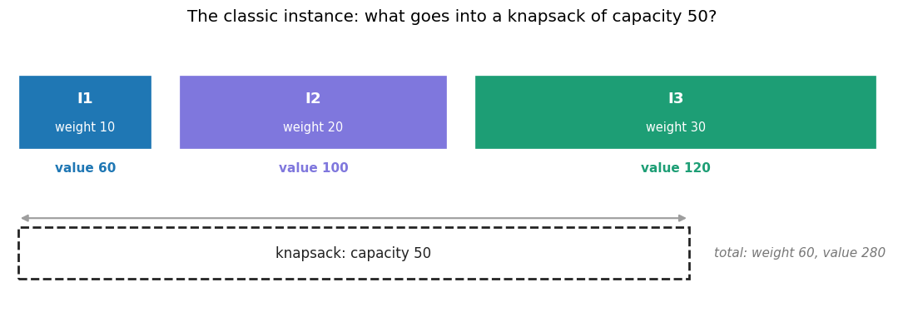

Two **instances** work throughout this walkthrough (both from the lecture notes):

- the **classic** one (above): `W = 50`, weights `[10, 20, 30]`, values `[60, 100, 120]` — used for brute force and for the greedy counterexample;
- the **small** one: `W = 4`, weights `[1, 2, 3]`, values `[6, 10, 12]` — its DP table is only 4×5 cells, so every cell fits on a figure.

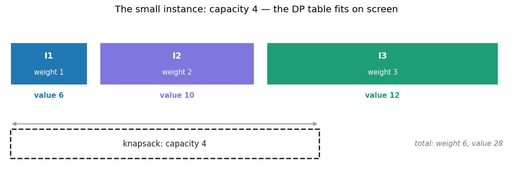

---

<a id="brute-idea"></a>

## The idea of brute force

Brute force is the simplest strategy: we **consider every possible candidate solution**, check each for feasibility and pick the best one.

In the knapsack, every item can be either **taken** or **not taken** — 2 states per item. With `n` items, the number of possible combinations (subsets) is:

$$2^n$$

For our problem: $2^3 = 8$ combinations. The algorithm:

1. Generate all $2^n$ subsets of items.
2. For each, compute the total weight and value.
3. Discard those with weight > capacity.
4. Among the feasible ones, pick the subset with the largest value.

<a id="brute-subsets"></a>

## All combinations for our problem

| Combination      | Weight | Value | Fits? |
|------------------|--------|-------|-------|
| { }              | 0      | 0     | ✅    |
| { I1 }           | 10     | 60    | ✅    |
| { I2 }           | 20     | 100   | ✅    |
| { I3 }           | 30     | 120   | ✅    |
| { I1, I2 }       | 30     | 160   | ✅    |
| { I1, I3 }       | 40     | 180   | ✅    |
| **{ I2, I3 }**   | **50** | **220** | ✅ **← maximum** |
| { I1, I2, I3 }   | 60     | 280   | ❌ (60 > 50) |

**Answer:** take items **I2 and I3** → weight 50, value **220**.

The same table as a figure — each subset's strip shows its weight against the capacity (dashed line), with the verdict on the right ([`examples/01_brute_force.py`](examples/01_brute_force.py)):

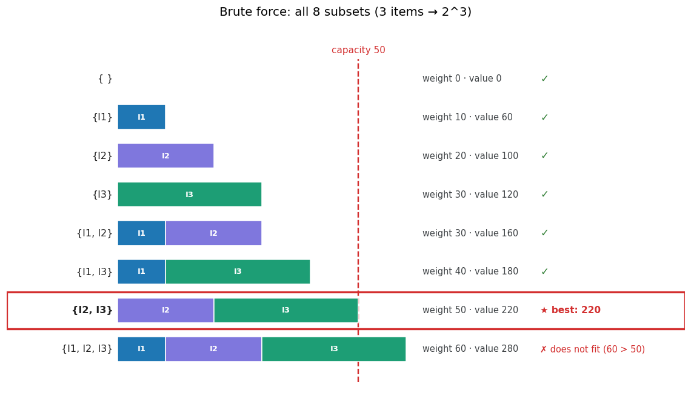

▶️ The search in motion — subsets appear one by one, the current leader is framed:

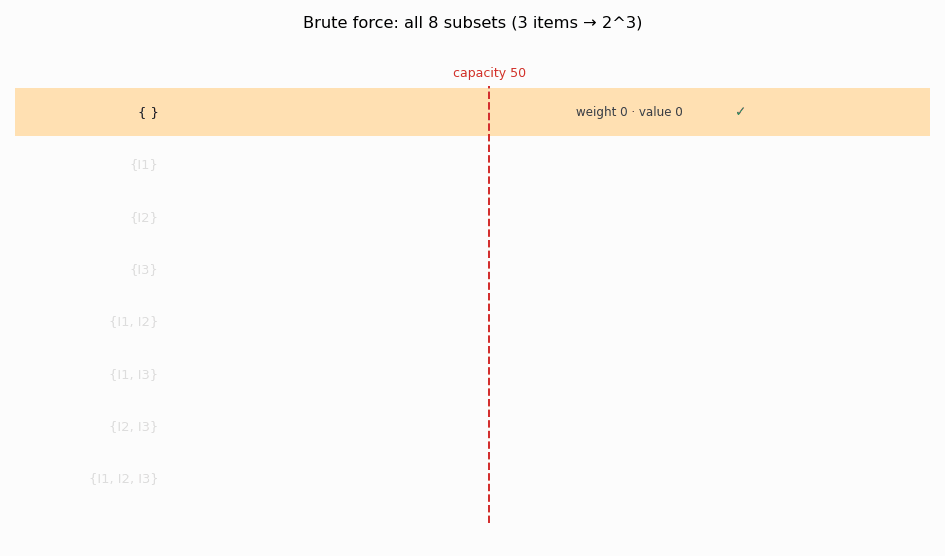

🎬 *MP4 version:* [`subsets_classic.mp4`](docs/images/en/subsets_classic.mp4)

And here is the console output of the enumeration — `★` marks subsets that became the new leader at the moment they were examined (smaller subsets go first, so the leader changes often; the final one is `{I2, I3}`):

```text
subset          weight      value  verdict
----------------------------------------------------------
{ }                 0          0  fits
{I1}               10         60  fits — new best ★
{I2}               20        100  fits — new best ★
{I3}               30        120  fits — new best ★
{I1, I2}           30        160  fits — new best ★
{I1, I3}           40        180  fits — new best ★
{I2, I3}           50        220  fits — new best ★
{I1, I2, I3}       60        280  does not fit (60 > 50)
```

<a id="brute-code"></a>

## The basic implementation — "take / skip" recursion

Here is the code from the lecture notes — the one we dissect line by line (the fully documented version is [`knapsack_recursive`](knapsack/core.py)):

```python
# A function that computes the maximum value
def knapSack(W, wt, val, n):
    # Base case
    if n == 0 or W == 0:
        return 0

    # If the weight of the n-th item exceeds the knapsack capacity, the item cannot be included
    if wt[n - 1] > W:
        return knapSack(W, wt, val, n - 1)

    # return the maximum of two cases:
    # (1) the n-th item is included
    # (2) it is not included
    else:
        return max(
            val[n - 1] + knapSack(W - wt[n - 1], wt, val, n - 1),
            knapSack(W, wt, val, n - 1),
        )

# weights and values of the items
value = [60, 100, 120]
weight = [10, 20, 30]
# knapsack capacity
capacity = 50
# number of items
n = len(value)
# call the function
print(knapSack(capacity, weight, value, n))  # 220
```

### The code, line by line

**`def knapSack(W, wt, val, n):`**
The function takes:
- `W` — the current free capacity,
- `wt` — the list of weights,
- `val` — the list of values,
- `n` — how many items are still under consideration.

**`if n == 0 or W == 0: return 0`**
The base (stopping) case of the recursion. If no items are left (`n == 0`) or the capacity is exhausted (`W == 0`), there is nothing more to add — return value 0.

**`if wt[n - 1] > W:`**
Look at the current item (its index is `n - 1`, since indexing starts at 0). If its weight exceeds the free capacity, taking it is **impossible**. So we simply move on to the remaining items: `knapSack(W, wt, val, n - 1)`.

**`else:` → `max(...)`** — the most important branch, dissected separately.

<a id="brute-branch"></a>

## The `else:` → `max(...)` branch in detail

The code reaches this branch when the item **fits** into the knapsack (`wt[n - 1] <= W`). In the 0/1 problem there are exactly **two things** you can do with an item: take it whole or skip it entirely. So we honestly evaluate **both** scenarios and keep the one with the larger value — that is what `max(...)` does.

**Option 1 — take the item:** `val[n - 1] + knapSack(W - wt[n - 1], wt, val, n - 1)`
- `val[n - 1]` — immediately "bank" the value of this item.
- `W - wt[n - 1]` — the capacity **shrinks** by the item's weight (the space is now occupied).
- `n - 1` — move on to the remaining items.

**Option 2 — skip the item:** `knapSack(W, wt, val, n - 1)`
- the item's value is **not added** (0);
- `W` — the capacity stays **unchanged** (the space is free);
- `n - 1` — likewise move on to the remaining items.

What changes in the two options:

| Action        | Accumulated value | Capacity `W`      | Items `n`    |
|---------------|-------------------|-------------------|--------------|
| Take the item | `+ val[n - 1]`    | `W - wt[n - 1]`   | `n → n - 1`  |
| Skip it       | `+ 0`             | `W` (unchanged)   | `n → n - 1`  |

> **Why `n - 1` in both cases?** The decision about the `n`-th item is already **made** (taken or not), and we never return to it. Both branches are left with the same smaller subproblem — "the best for the first `n - 1` items". The branches differ only in the **capacity** and the **already banked value**. This take/skip fork at every item is exactly what produces all $2^n$ combinations.

**A concrete example.** The call `knapSack(W=50, n=3)`, the current item is **I3** (weight 30, value 120):

- **Take I3:** `120 + knapSack(20, ..., 2)` — bank 120, the capacity drops to `50 − 30 = 20`, then find the best for I1–I2 with capacity 20. Result: `120 + 100 = 220`.
- **Skip I3:** `knapSack(50, ..., 2)` — add nothing, the capacity stays 50, find the best for I1–I2 with capacity 50. Result: `160`.

`max(220, 160) = 220` → it pays to **take I3** (paired with I2).

<a id="brute-tree"></a>

## The recursion tree

The same "take or not?" question repeats for item 2, then for item 1 — the branches double, and a tree emerges. Each **level** decides the fate of one item: the root — I3, below it — I2, the leaves — single-item subproblems with I1:

```
knapSack(50, 3)
│
├─ take I3 (+120) ─→ knapSack(20, 2) = 100
│  ├─ take I2 (+100) ─→ knapSack(0, 1)  = 0     (base: W=0)
│  └─ skip I2         ─→ knapSack(20, 1) = 60
│     max(100, 60) = 100;  "take I3": 120 + 100 = 220   ★ optimum
│
└─ skip I3 ───→ knapSack(50, 2) = 160
   ├─ take I2 (+100) ─→ knapSack(30, 1) = 60
   └─ skip I2         ─→ knapSack(50, 1) = 60
      max(160, 60) = 160

ROOT:  max(220, 160) = 220  →  take I3 and I2 (weight 50, value 220)
```

How to read the tree:

- every node states how much value its subproblem yields at best (`knapSack(50, 2) = 160` — "the best for items I1–I2 with capacity 50");
- the value is collected on the "take" edges (+120, +100), not in the leaf nodes;
- hence the optimal path ★: the leaf gives 0 → take I2 (+100) → 100 → take I3 (+120) → **220**.

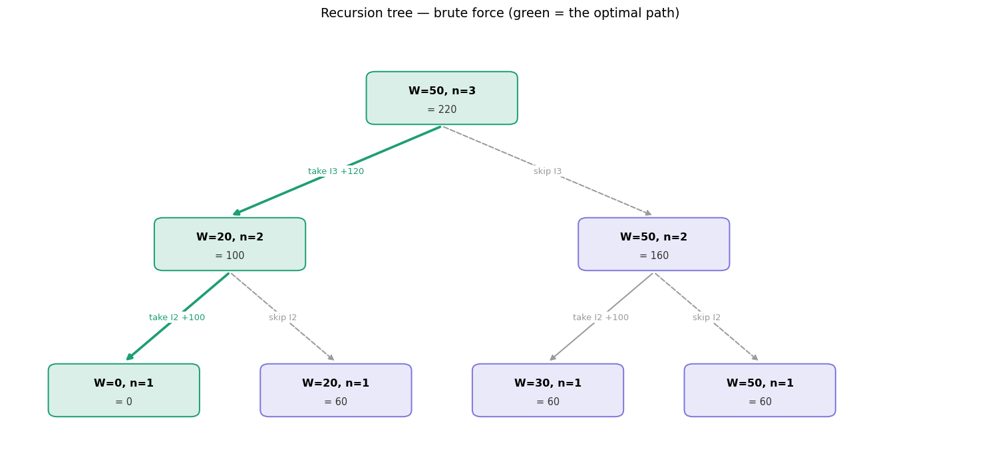

<a id="brute-trace"></a>

## Execution order (a trace)

Python evaluates the first argument of `max(...)` before the second, so the function always tries the "take" branch first, descends to the base case, and computes `max` on the way back:

1. `knapSack(50, 3)` — item I3 fits, so we compute `max(take, skip)`. "Take" goes first.
2. Took I3 (+120) → descend into `knapSack(20, 2)`.
3. Item I2 fits. First "take I2" (+100) → descend into `knapSack(0, 1)`.
4. `knapSack(0, 1)`: the space is gone (`W = 0`) → base case → returns **0**. The "take I2" branch gave `100 + 0 = 100`.
5. Now "skip I2" → `knapSack(20, 1)` returns 60. Node total: `max(100, 60) = 100`.
6. Back at the root: the "take I3" branch = `120 + 100 = 220`.
7. Now "skip I3" → `knapSack(50, 2) = 160` (the right part of the tree).
8. Root: `max(220, 160) = 220` — the answer. I3 and I2 end up in the knapsack.

<a id="brute-itertools"></a>

## Explicit subset enumeration (`itertools`)

The recursion enumerates combinations implicitly — via the call branching. The same search can be written head-on: generate all index subsets and check each one. Bonus: this version returns not just the value but **the set itself**. The code from the lecture notes (full version — [`knapsack_brute_force`](knapsack/core.py)):

```python
from itertools import combinations

def knapsack_brute_force(W, wt, val):
    n = len(val)
    best_value = 0
    best_combo = ()

    # enumerate all possible subsets of items (2^n of them)
    for r in range(n + 1):
        for combo in combinations(range(n), r):
            total_weight = sum(wt[i] for i in combo)
            total_value = sum(val[i] for i in combo)
            # count only those that fit into the knapsack
            if total_weight <= W and total_value > best_value:
                best_value = total_value
                best_combo = combo

    return best_value, best_combo
```

Both versions give the same answer ([`examples/01_brute_force.py`](examples/01_brute_force.py)):

```text
Recursive version (from the lecture notes): 220
Maximum value: 220
Chosen items (indices): (1, 2)
That is, the set {I2, I3}: weight 50, value 220.
```

> The indices `(1, 2)` are positions in the `weight`/`value` lists (zero-based), i.e. items **I2** and **I3**.

<a id="brute-explosion"></a>

## Why it explodes: the price of 2ⁿ

No branch of the tree is ever skipped — the function checks **absolutely all** combinations (8 here). That is why the method is called brute force. Therein lie its strength (the answer is guaranteed exact) and its curse: every new item **doubles** the number of branches.

```text
Growth of the number of subsets 2^n:
  n =  3  →  2^3 = 8 subsets
  n = 10  →  2^10 = 1 024 subsets
  n = 20  →  2^20 = 1 048 576 subsets
  n = 30  →  2^30 = 1 073 741 824 subsets
  n = 40  →  2^40 = 1 099 511 627 776 subsets
  n = 50  →  2^50 = 1 125 899 906 842 624 subsets
```

On a log scale the exponential $2^n$ is a straight line that leaves the polynomial $n \cdot W$ far below. The right panel shows a concrete 20-item instance: over a **million** subsets versus **1,281** DP table cells:

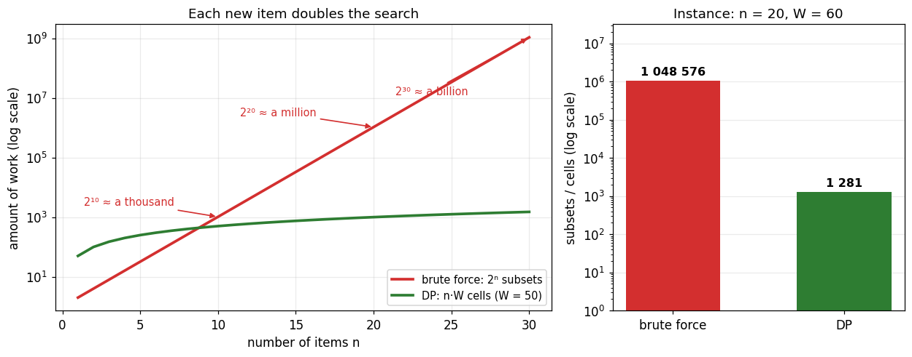

The script [`examples/01_brute_force.py`](examples/01_brute_force.py) honestly runs both approaches on that instance (20 items, `W = 60`, the numbers are pinned in [`examples/_items.py`](examples/_items.py)):

```text
Brute force must inspect 2^20 = 1 048 576 subsets;
DP fills a table of (n+1)×(W+1) = 21×61 = 1 281 cells.
Same answer: brute force = 283, DP = 283  →  match: True
```

On the test machine the brute force takes **about a second** for this instance, while DP takes a **fraction of a millisecond** (a 3–4 orders-of-magnitude gap); the exact time depends on the machine, so the script measures and prints it as a separate line. With 30 items the brute force would take a **thousand times** longer — hours; DP would remain instant.

### Pros and cons of brute force

**Pros**
- **Simplicity.** The logic is obvious, easy to understand and implement.
- **A guaranteed result.** Since absolutely every variant is checked, the answer is always optimal (exact, not approximate).
- **Universality.** Works for almost any problem whose candidates can be enumerated.

**Cons**
- **Exponential complexity — $O(2^n)$.** The number of combinations doubles with every new item: 10 items → 1,024 variants, 30 items → over a billion, 50 → an astronomical number.
- **Unusable on large inputs.** With a few dozen items the computation already becomes infeasible in reasonable time.
- **Wastefulness.** Many variants are recomputed "from scratch" although they share subproblems (this is exactly what dynamic programming fixes).

---

<a id="dp-idea"></a>

## Dynamic programming: a cheat sheet of subproblems

Dynamic programming (DP) is a way to solve a hard problem by splitting it into smaller subproblems, solving each **only once** and **storing** the results so they are never recomputed.

**When it applies:** the problem must have two properties —
- *optimal substructure*: the solution of the big problem is built from solutions of smaller ones;
- *overlapping subproblems*: the same smaller problems occur many times.

The knapsack has both. Look at the recursion tree again: different branches keep arriving at **identical** subproblems `knapSack(w, m)` — and naive recursion honestly recomputes them every time. DP instead computes each one once.

Imagine filling out a **cheat sheet** (a table) where every cell answers one small question:

> "What is the largest value I can collect if only the **first `i` items** are allowed and the knapsack holds **`w` units**?"

That is exactly **`K[i][w]`**. The point is not to attack the big question at once, but to fill the cheat sheet from the easiest questions to the hardest:

1. **The easiest cases.** No items (`i = 0`) or no space (`w = 0`) — the answer is always **0**. These are the top row and the left column.
2. **Add items one at a time.** For each new item, sweep all knapsack sizes and ask a single question: **take this item or not?**
   - **Skip:** the answer is the same as without it → look at the cell **directly above**.
   - **Take:** add its value + the best that fits into the **remaining space**. And that is already written in the cheat sheet (one row up, exactly the item's weight to the left).
   - Keep the **larger** of the two numbers.
3. Reach the last item and the full capacity → the answer sits in the **bottom-right corner** `K[n][W]`.

**The whole trick:** brute force re-answers the same sub-questions over and over (hence slow). Dynamic programming answers every sub-question **once**, writes it into the table — and then simply **looks it up** instead of recomputing.

<a id="dp-formula"></a>

## The transition formula

For every item `i` and capacity `w`:

```
if wt[i-1] > w:    K[i][w] = K[i-1][w]
otherwise:         K[i][w] = max( K[i-1][w] ,  val[i-1] + K[i-1][w - wt[i-1]] )
                                  └─ skip ──┘   └─────────── take ───────────┘
```

- If the item **does not fit** (`wt[i-1] > w`) — copy the value from above (the only possible move is to skip).
- Otherwise take the better of two: **skip** (the value from above) versus **take** (the item's value + the best solution for the remaining capacity over the previous items).

Note: this is **the same** take/skip pair as in the brute-force recursion. The only difference is that the answers to subproblems are no longer recomputed — they are **read from the row above**.

<a id="dp-code"></a>

## The basic implementation — table `K[i][w]`

The code from the lecture notes (the fully documented version is [`knapsack_dp`](knapsack/core.py)):

```python
def knapSack(W, wt, val, n):
    # create table K that stores the optimal values of subproblems
    K = [[0 for w in range(W + 1)] for i in range(n + 1)]

    # build table K bottom-up
    for i in range(n + 1):
        for w in range(W + 1):
            if i == 0 or w == 0:
                K[i][w] = 0
            elif wt[i - 1] <= w:
                K[i][w] = max(val[i - 1] + K[i - 1][w - wt[i - 1]], K[i - 1][w])
            else:
                K[i][w] = K[i - 1][w]

    return K[n][W]
```

### The code, line by line

- `K = [[0 ...] for i in range(n + 1)]` — a table with `n + 1` rows (0…n items) and `W + 1` columns (capacity 0…W), filled with zeros.
- The two loops `for i ... for w ...` sweep all subproblems (every item × every capacity).
- `if i == 0 or w == 0:` → `K[i][w] = 0` — with no items or no space the value is zero (the base cases: the top row and the left column).
- `elif wt[i - 1] <= w:` — the current item fits, so take the better of two options:
  - `val[i - 1] + K[i - 1][w - wt[i - 1]]` — **take**: its value + the best solution for the remaining capacity over the previous items;
  - `K[i - 1][w]` — **skip**: carry the value down from the row above.
- `else:` → `K[i][w] = K[i - 1][w]` — the item does not fit; carry the value from above.
- `return K[n][W]` — the answer sits in the bottom-right corner.

> **Why `i - 1` as the index:** `i` is the *count* of items under consideration, while the lists `wt`/`val` are 0-indexed, so the `i`-th item has index `i - 1`.

<a id="dp-nofit"></a>

## Why "does not fit" copies the value from above

**The point:** if the item does not fit, the only possible move is to skip it — and that is exactly the ready-made answer for a set one item smaller.

Recall what the cell means: **`K[i][w]`** is the best value collectable when only the **first `i` items** are allowed and the capacity is `w`. When we reach item `i`, there are always **exactly two options**: take it or skip it. `max(...)` picks the better one.

But when `wt[i-1] > w` (the item is heavier than the free space), the **"take" option becomes impossible** — the item physically does not fit. The only option left is **"skip"**.

And what does "skip item `i`" mean? That the set we actually choose from shrinks to the **first `i − 1` items**, while the capacity stays the same `w` (we put nothing in). The best answer for that situation is already computed — it is **`K[i−1][w]`**. Row `i − 1` is "one item fewer", the same column `w` is "the same capacity": cell `K[i−1][w]` sits **directly above** `K[i][w]`. So "skip an item that does not fit" = "copy the ready answer from the cell above".

**It is not a loss — it is "nothing changed".** Adding one more item that we cannot use anyway can neither improve nor worsen the result. So the optimum stays the same as in the previous row.

**It is a special case of the general formula.** "Copy from above" is not a separate rule but a simplification of `max`:

```
K[i][w] = max( K[i-1][w] ,  val + K[i-1][w - wt] )
               ▲                     ▲
             skip                  take   ← drops out: the item does not fit
```

When "take" is impossible, only the first term remains in `max` → `K[i][w] = K[i-1][w]`.

**An example from the table below.** `K[2][1]`: item I2 weighs 2, but the capacity is only 1. Since 2 > 1, I2 does not fit. Then "the best of {I1, I2} with capacity 1" = "the best of {I1} with capacity 1" = **6**. That very value sits above, in `K[1][1]`. The new item did not fit — the answer did not change.

<a id="dp-walkthrough"></a>

## Filling the table step by step (the small instance)

To fit every cell on screen, we switch to the **small instance**: a knapsack of capacity **4** and items I1 (weight 1, value 6), I2 (weight 2, value 10), I3 (weight 3, value 12). The table is just 4×5. All figures and outputs of this section are produced by [`examples/02_dp_small.py`](examples/02_dp_small.py).

How to read the visualization:

- 🟧 **orange frame** — the cell being filled right now;
- 🟦 **blue cell** — the "skip" source (directly above the current one);
- 🟩 **green cell** — the "take" source (one row up, exactly the item's weight to the left);
- 🟨 **yellow cells** — the backward-pass path (appears during reconstruction);
- 🔴 **red frame** — the answer cell `K[n][W]`.

### Start: the base row

Create a table of zeros. Row `i = 0` ("no items") is a ready base case; column `w = 0` is always 0 as well:

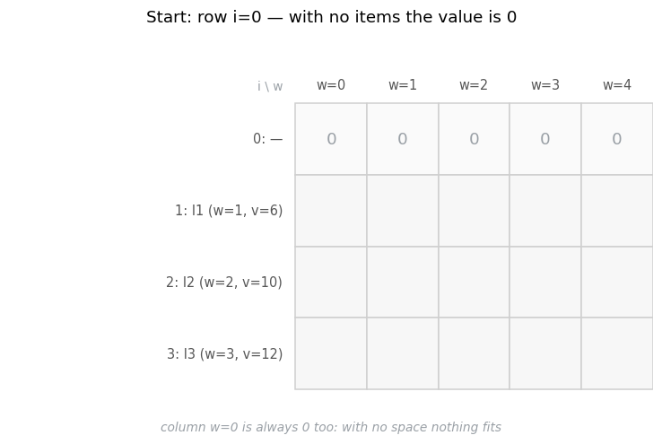

### Row i=1 — only I1 allowed (weight 1, value 6)

I1 (weight 1) fits into any capacity from 1 up, so "take" (6) beats "skip" (0) everywhere:

```text
=== Row i=1  (I1: weight=1, value=6) ===
K[1][0]: base case (w=0)  =>  0
K[1][1]: weight 1 <= 1 -> fits -> max(skip=0, take 6+K[0][0]=6)  =>  6
K[1][2]: weight 1 <= 2 -> fits -> max(skip=0, take 6+K[0][1]=6)  =>  6
K[1][3]: weight 1 <= 3 -> fits -> max(skip=0, take 6+K[0][2]=6)  =>  6
K[1][4]: weight 1 <= 4 -> fits -> max(skip=0, take 6+K[0][3]=6)  =>  6
```

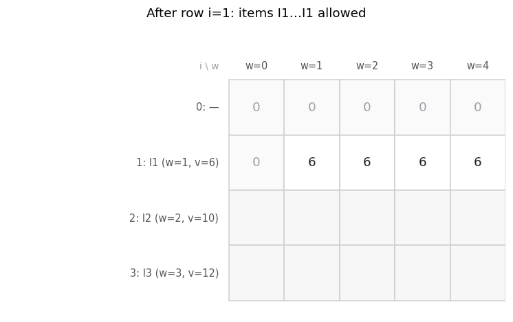

### Row i=2 — I1 and I2 allowed (I2: weight 2, value 10)

All scenarios are already visible here: at `w = 1` I2 **does not fit** (copy 6 from above), at `w = 2` it pays to **replace** I1 with I2 (10 > 6), and from `w = 3` on **both** fit (10 + 6 = 16):

```text
=== Row i=2  (I2: weight=2, value=10) ===
K[2][0]: base case (w=0)  =>  0
K[2][1]: weight 2 > 1 -> does not fit -> take from above K[1][1]=6  =>  6
K[2][2]: weight 2 <= 2 -> fits -> max(skip=6, take 10+K[1][0]=10)  =>  10
K[2][3]: weight 2 <= 3 -> fits -> max(skip=6, take 10+K[1][1]=16)  =>  16
K[2][4]: weight 2 <= 4 -> fits -> max(skip=6, take 10+K[1][2]=16)  =>  16
```

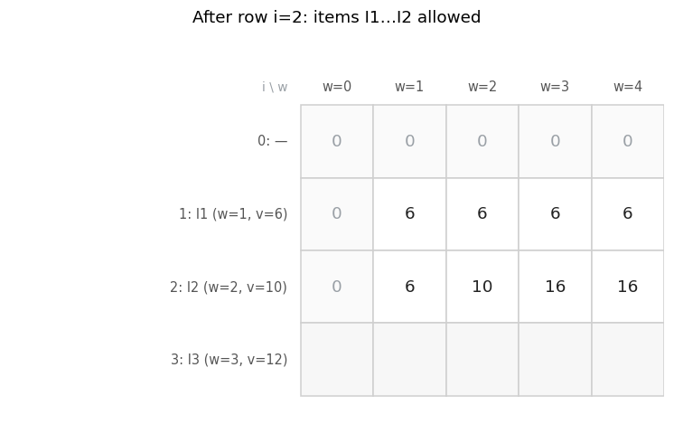

### Row i=3 — all items allowed (I3: weight 3, value 12)

The most interesting row. At `w = 3` item I3 **fits, but taking it does not pay** (12 < 16) — `max` keeps "skip". And only at `w = 4` the true answer appears: `12 + K[2][1] = 12 + 6 = 18`:

```text
=== Row i=3  (I3: weight=3, value=12) ===
K[3][0]: base case (w=0)  =>  0
K[3][1]: weight 3 > 1 -> does not fit -> take from above K[2][1]=6  =>  6
K[3][2]: weight 3 > 2 -> does not fit -> take from above K[2][2]=10  =>  10
K[3][3]: weight 3 <= 3 -> fits -> max(skip=16, take 12+K[2][0]=12)  =>  16
K[3][4]: weight 3 <= 4 -> fits -> max(skip=16, take 12+K[2][1]=18)  =>  18
```

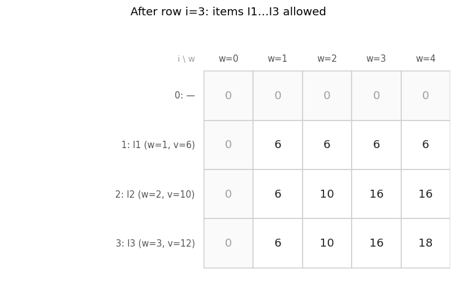

<a id="dp-cells"></a>

## The most interesting cells — the formula in the frame

Four "landmark" cells in close-up: the table is filled exactly up to the current cell, arrows come from the sources, the transition formula with the actual numbers sits below.

**`K[1][1]` — the first "take".** I1 squeezes into a single unit of capacity; `max(0, 6) = 6`:

![Cell K[1][1]: the first take](docs/images/en/dp_cell_small_i1_w1.png)

**`K[2][3]` — a "take" with a non-zero remainder.** We put in I2 (weight 2), 1 unit remains — and the best for it is already computed one row above: `K[1][1] = 6`. Together `10 + 6 = 16`:

![Cell K[2][3]: take + remainder](docs/images/en/dp_cell_small_i2_w3.png)

**`K[3][3]` — fits, but we do NOT take it.** The most instructive case: I3 physically fits, yet `take = 12 + K[2][0] = 12` loses to `skip = 16` (the pair I1+I2 is worth more than a lone I3):

![Cell K[3][3]: fits but not taken](docs/images/en/dp_cell_small_i3_w3.png)

**`K[3][4]` — the answer cell.** `take = 12 + K[2][1] = 18` beats `skip = 16`:

![Cell K[3][4]: the answer 18](docs/images/en/dp_cell_small_i3_w4.png)

▶️ All 15 cells in a row — the full filling animation with the formula in every frame:

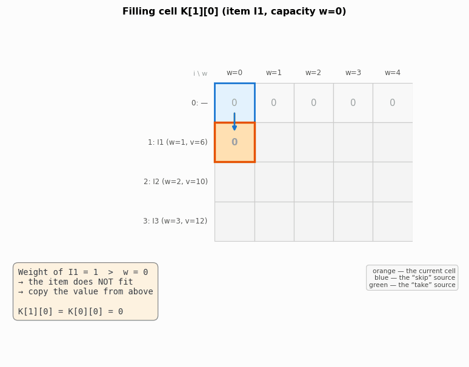

🎬 *MP4 version:* [`dp_fill_small.mp4`](docs/images/en/dp_fill_small.mp4)

<a id="dp-evolution"></a>

## The big picture: evolution of the table

All states side by side: each row "inherits" the previous one and improves it in places. Numbers grow left to right within a row (more space is never worse) and top to bottom within a column (more items are never worse):

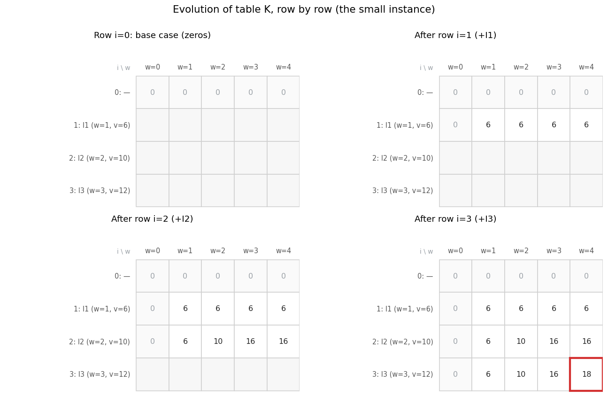

▶️ The same in motion:

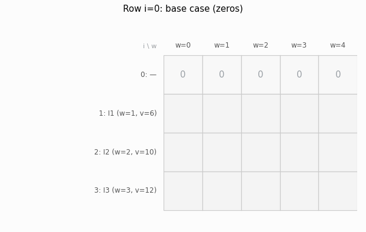

🎬 *MP4 version:* [`dp_evolution_small.mp4`](docs/images/en/dp_evolution_small.mp4)

The final table and the answer in text form:

```text
 i \ w |   0   1   2   3   4
-------+--------------------
 0 (—) |   0   0   0   0   0
 1 +I1 |   0   6   6   6   6
 2 +I2 |   0   6  10  16  16
 3 +I3 |   0   6  10  16  18

ANSWER = K[3][4] = 18
```

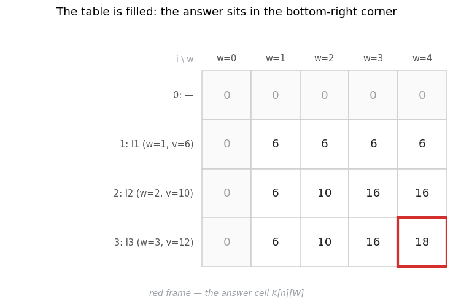

<a id="dp-backtrack"></a>

## The answer and reconstructing the set by a backward pass

The table only says **how much** the optimum is worth (`K[3][4] = 18`), not **what it consists of**. To extract the set itself, walk the table **bottom-up** — the analogue of path reconstruction in graph algorithms, except the table `K` itself plays the role of the predecessor matrix.

The key observation: the value `K[i][w]` could only have come **from two places** — either it is `K[i-1][w]` (item `i` was skipped), or it is `val[i-1] + K[i-1][w - wt[i-1]]` (it was taken). So it suffices to compare the cell with the value **directly above it**:

- `K[i][w] == K[i-1][w]` → item `i` was **skipped**; go one row up with the same `w`;
- `K[i][w] != K[i-1][w]` → such a value could only come from the "take" branch → item `i` is **in the set**; go one row up and **free its weight**: `w -= wt[i-1]`.

The code from the lecture notes (full version — [`reconstruct_items`](knapsack/core.py)):

```python
# Backward pass: reconstruct the set of items
w = W
chosen = []
for i in range(n, 0, -1):
    if dp[i][w] != dp[i - 1][w]:      # the value changed -> item i was taken
        chosen.append(names[i - 1])
        w -= weights[i - 1]           # free the weight the item occupied
chosen.reverse()
```

> In the lecture notes the table is called `dp` in this fragment — it is the same `K` (both names appear in the literature). One more difference: the notebook fragment collects item **names** (`names[i - 1]`), while the package's [`reconstruct_items`](knapsack/core.py) returns **0-based indices** of the chosen items — the examples attach the names afterwards.

The run on the small instance — three comparisons, three decisions:

```text
i=3, w=4: K[3][4]=18 ≠ K[2][4]=16 → I3 TAKEN, w ← 1
i=2, w=1: K[2][1]=6 = K[1][1]=6 → I2 not taken
i=1, w=1: K[1][1]=6 ≠ K[0][1]=0 → I1 TAKEN, w ← 0

Chosen items: ['I1', 'I3']
Total weight:    4
Total value: 18
```

In the figure the path is highlighted in yellow: a green arrow = "item taken" (a jump up-and-left by its weight), a gray dashed one = "skipped" (straight up):

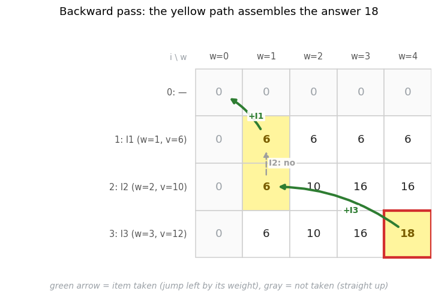

▶️ Step by step — each frame shows one "cell versus the cell above" comparison:

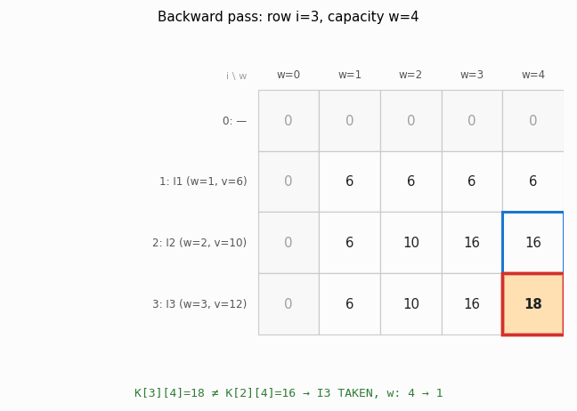

🎬 *MP4 version:* [`backtrack_small.mp4`](docs/images/en/backtrack_small.mp4)

<a id="dp-classic"></a>

## The classic instance: a table for W = 50

Back to the original problem (`W = 50`, weights `[10, 20, 30]`). The table here is 4 rows × **51 columns**, but since all weights are multiples of 10, the values only change at capacities that are multiples of 10. So we show the condensed version ([`examples/03_dp_classic.py`](examples/03_dp_classic.py)):

```text
 i \ w |   0  10  20  30  40  50
-------+------------------------
 0 (—) |   0   0   0   0   0   0
 1 +I1 |   0  60  60  60  60  60
 2 +I2 |   0  60 100 160 160 160
 3 +I3 |   0  60 100 160 180 220

ANSWER = K[3][50] = 220
```

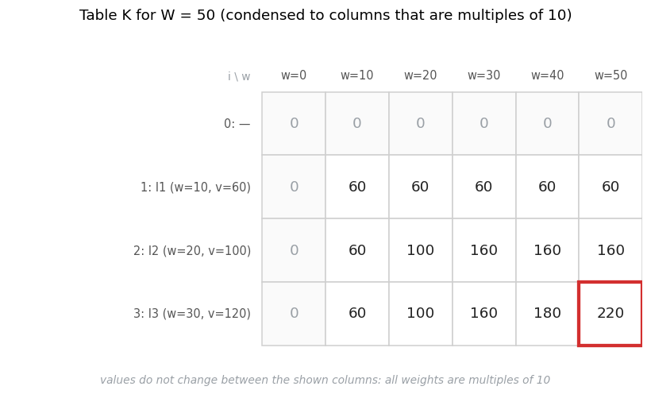

How the bottom row (all three items allowed) "ripened":

- `w = 0…9` → 0 (nothing fits);
- `w = 10…19` → 60 (only I1 fits);
- `w = 20…29` → 100 (I2 alone beats I1);
- `w = 30…39` → 160 (I1 + I2);
- `w = 40…49` → 180 (I1 + I3 overtakes I1 + I2);
- exactly `w = 50` → **220** (I2 + I3 — this pair needs exactly 50 units).

**How the answer 220 emerged.** Look at the bottom-right cell `K[3][50]`. Item I3 weighs 30 ≤ 50, so we take the maximum of two options:

- **skip I3:** the value from above → `K[2][50] = 160`;
- **take I3:** its value + the solution for the remaining capacity (`50 − 30 = 20`) over the two previous items → `120 + K[2][20] = 120 + 100 = 220`.

`max(160, 220) = 220`. "Take I3" wins, and the final answer is assembled from cells `K[2][50]` and `K[2][20]` — I3 and I2 end up in the knapsack.

The backward pass confirms it (all of its stops — `w = 50 → 20 → 0` — are multiples of 10, so they land on the condensed columns):

```text
Chosen items: ['I2', 'I3']
Total weight:    50
Total value: 220
```

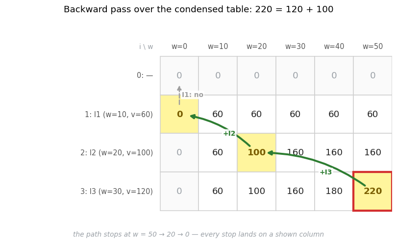

The very same **220** the brute force produced — for just 204 cell operations instead of inspecting every subset (for 3 items the difference is negligible, but it grows exponentially with `n`).

---

<a id="code-walkthrough"></a>

## Step-by-step code execution: code ↔ table panels

The sections above showed the *result* of every step — how the table "ripens". Here is **the code itself in action**: on the left, the algorithm fragment with **highlighted active lines**; on the right, the state of table `K` at that very step. **The color of a code line encodes which branch fired:** 🟨 the line is executing now, 🟩 the "take" branch won, 🟥 the value was simply carried from above ("skip" won or the item does not fit).

> In the code panel `max(take, skip)` is unrolled into three lines (`take = …`, `skip = …`, `max(…)`) — as in the logging version from the lecture notes: so that the "take" and "skip" branches highlight separately.

Both levels of detail are built from a single step journal ([`knapsack/walkthrough.py`](knapsack/walkthrough.py); the right panel reuses `draw_dp_table`); they are generated by [`examples/06_code_walkthrough.py`](examples/06_code_walkthrough.py).

### Overview: one step per table row

The outer loop `for i` adds items one by one; the right panel shows the table after each row:

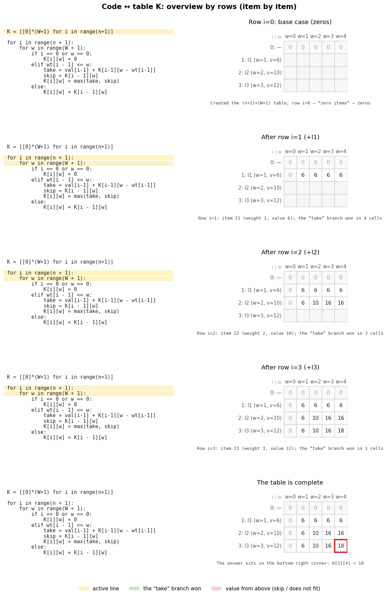

### In detail: one step = one cell

For the most illustrative row (`i = 3` — it contains **all** transition branches: base, "does not fit", "skip" and "take") we unroll the inner loop cell by cell:

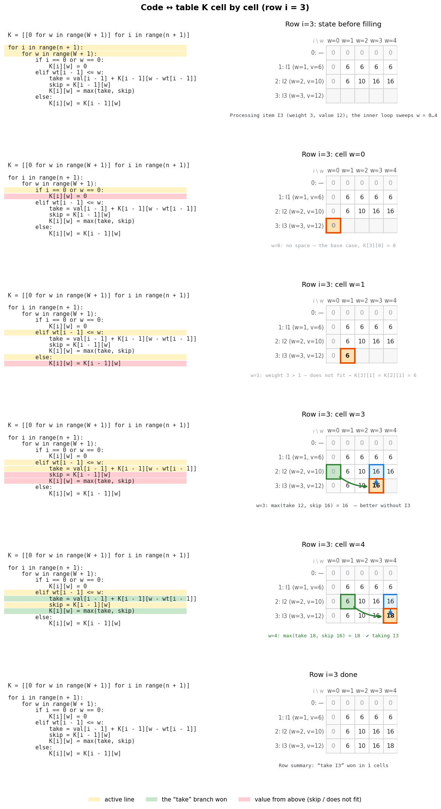

▶️ The same in motion — a full sweep of the row `w = 0…4`:

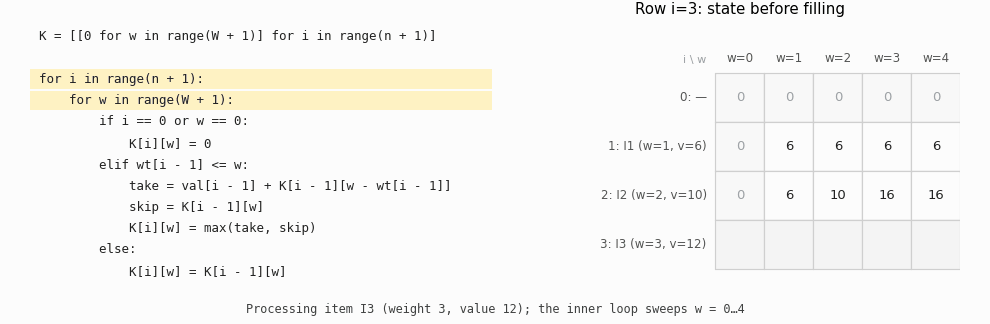

🎬 *MP4 version:* [`code_walk_small_i3.mp4`](docs/images/en/code_walk_small_i3.mp4)

### The same code on the classic instance

The code did not change by a single character — only the data did (`W = 50`, columns condensed to multiples of 10):

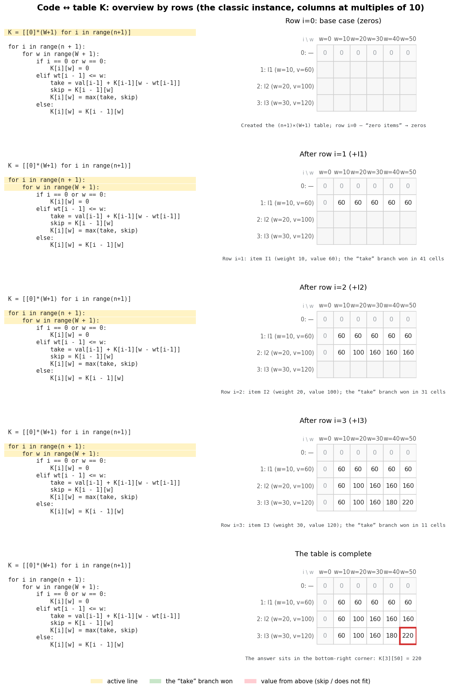

---

<a id="comparison"></a>

## Comparing the three approaches

All three methods on **one** classic instance ([`examples/03_dp_classic.py`](examples/03_dp_classic.py)):

```text
Brute force (recursion):     220
Brute force (itertools):     220, set {I2, I3}
Dynamic programming:         220, set {I2, I3}
Greedy method:               160  ← NOT optimal (loses 60)
```

| Method           | Answer | Complexity | Memory | Optimal? |
|------------------|--------|------------|--------|----------|
| Brute force      | 220    | $O(2^n)$   | $O(n)$ | ✅ yes   |
| Greedy           | 160    | $O(n \log n)$ | $O(1)$ | ❌ no (for 0/1) |
| Dynamic progr.   | 220    | $O(n \cdot W)$ | $O(n \cdot W)$ | ✅ yes   |

**Conclusion:** brute force and DP both produce the correct 220, but DP does it far more efficiently. Greedy is the fastest, yet for the 0/1 problem it can be wrong.

> **About ties.** When several optimal sets exist (different sets with the same maximum value), the exact methods may name different ones: brute force returns the first one found in enumeration order (smaller subsets first), while the DP backward pass assembles its set by the "tie → skip" rule. **The value always agrees** — and that is what the tests compare. On the classic instance the optimal set is unique, so there is no divergence here.

### The complexities in plain words

**Brute force — $O(2^n)$ — exponential.**
The method checks every combination of items: take or skip. So each new item doubles the number of variants. With few items it works fine; with many it becomes unusably slow.

**Greedy — $O(n \log n)$ — linearithmic.**
First the items are sorted by value-to-weight ratio — the sorting dominates the running time. Then the algorithm makes one quick pass over the list. Greedy is therefore very fast, but for the 0/1 problem it does not always find the best result.

**Dynamic programming — $O(n \cdot W)$ — pseudo-polynomial.**
The method fills a table of decisions for every item × every capacity: `n` is the number of items, `W` the knapsack capacity. DP is dramatically faster than brute force and guarantees the optimal answer, but needs $O(n \cdot W)$ memory for the table (it can be optimized to $O(W)$ by keeping a single row — at the cost of losing the simple backward-pass reconstruction).

**When to use which:**

- **brute force** — when there are very few items (up to ~20) or you need an indisputable reference to validate other methods (exactly how it is used in this repository's [tests](tests/test_core.py));
- **DP** — when `n · W` is moderate (thousands to millions of cells): both exact and fast;
- **greedy** — only as a quick "better than nothing" heuristic, or for the *fractional* problem where it actually is optimal.

---

<a id="greedy"></a>

## Limitation 1: greedy does not solve the 0/1 problem

Many people's first thought: "grab the items with the best value per unit while they fit". That is the **greedy strategy**:

1. For every item compute the "value density" = **value / weight**.
2. Sort the items by this ratio in decreasing order.
3. Walk the list and take an item whenever it still fits into the knapsack.

> ⚠️ **Important.** For the **0/1** problem (an item is taken whole or not at all) the greedy method **does not guarantee the optimal result**. It is optimal only for the **fractional** problem (where items can be taken in parts).

The code from the lecture notes (full version — [`knapsack_greedy`](knapsack/core.py)):

```python
class Item:
    def __init__(self, weight, value):
        self.weight = weight
        self.value = value
        self.ratio = value / weight

def knapSack(items: list[Item], capacity: int) -> int:
    items.sort(key=lambda x: x.ratio, reverse=True)
    total_value = 0
    for item in items:
        if capacity >= item.weight:
            capacity -= item.weight
            total_value += item.value
    return total_value
```

### The code explained

- `self.ratio = value / weight` — the `Item` constructor immediately computes the "value density" (value per unit of weight); greedy will choose by it.
- `items.sort(key=lambda x: x.ratio, reverse=True)` — sort in decreasing order: the best "per unit" items first.
- `for item in items:` + `if capacity >= item.weight:` — walk in sorted order; if the item still fits, take it: shrink the free space, add the value.
- If it does not fit, the item is simply skipped (no fractions in the 0/1 problem) — and the algorithm **never reconsiders**.

### The run on our data

```text
Value density (value / weight):
  I1: 60 / 10 = 6.0
  I2: 100 / 20 = 5.0
  I3: 120 / 30 = 4.0
```

The order after sorting stays the same: I1 (6.0) → I2 (5.0) → I3 (4.0). Then ([`examples/04_greedy_limitation.py`](examples/04_greedy_limitation.py)):

```text
Greedy run (by decreasing ratio):
  I1 (weight 10): taken   → free 50 → 40, value 60
  I2 (weight 20): taken   → free 40 → 20, value 160
  I3 (weight 30): skipped (needs 30 > free 20)

Greedy result: 160
Optimum (DP on the same instance): 220
Greedy lost 60: the cheap “best per unit” I1 blocked the pair {I2, I3}.
```

### Why greedy loses

Greedy was seduced by the small I1 with the highest `ratio` — and because of that it could not take the heavy I3. Compare the packings:

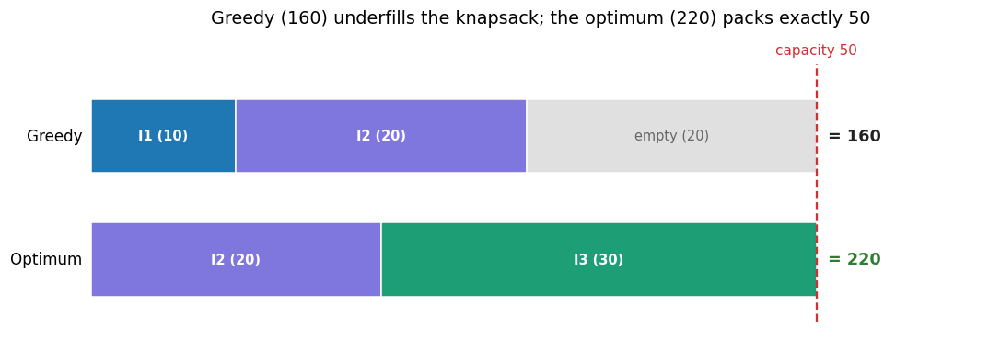

Greedy looks only at the current item's density and fails to notice that giving up I1 would free space for the far more valuable pair {I2, I3}, which fills the knapsack **exactly** (50 of 50). It is fast ($O(n \log n)$), but a "locally best" choice does not add up to a globally best one.

> **Then why is greedy optimal for the fractional problem?** There, when the next item does not fit whole, you may take a **fraction** of it and top the knapsack up to the last unit with the most valuable available "substance". No empty space remains — and empty space was the sole reason for losing in 0/1. On our example the fractional greedy would take I1, I2 and **two thirds of I3** (`160 + 80 = 240` — more than 220, because it is a different, easier problem).

### Pros and cons of the greedy method

**Pros**
- **Very fast.** Complexity ≈ $O(n \log n)$ (sorting dominates).
- **Tiny memory footprint.** No tables, no recursion tree.
- **Simple** to implement and to understand.

**Cons**
- **No optimality guarantee for the 0/1 problem** — may return a worse answer (here: 160 instead of 220).
- **Hostage to local choices** — never reconsiders past decisions.
- Optimal only for the **fractional** knapsack.

<a id="pseudo"></a>

## Limitation 2: a huge W (pseudo-polynomiality)

$O(n \cdot W)$ looks polynomial — but it is a polynomial in the **number** `W`, not in the **size of the input**. The number `W` occupies only $\log_2 W$ bits of the input, so relative to the input length the complexity is actually exponential: $O(n \cdot 2^{\text{bits of } W})$. That is why it is called **pseudo-polynomial**.

In practice this means: DP is wonderful while `W` is moderate, and helpless when `W` is enormous.

- `n = 30, W = 1,000` → a table of ~31 thousand cells — instant.
- `n = 30, W = 10,000,000` → ~310 **million** cells — both time and memory already hurt.
- `n = 30, W = 10¹⁵` (say, weights in milligrams at a freight warehouse) → the table physically cannot exist. Meanwhile $2^{30}$ ≈ a billion brute-force branches is suddenly **less** than `n · W`: on such data honest enumeration (and its smarter variants like meet-in-the-middle at $O(2^{n/2})$) beats DP.
- fractional weights (`2.37 kg`) do not index into a table at all without scaling to integers — and scaling inflates `W` again.

This is not an accidental implementation flaw: the 0/1 knapsack problem is **NP-complete**, so no algorithm polynomial in the input length is known for it. Every exact method pays with an exponential somewhere — enumeration in `n`, DP in the bits of `W`. When both dimensions are too large, what remains are approximation schemes (notably an FPTAS — DP over *values* with a controlled error) or heuristics like greedy — with no optimality guarantee.

> The rule of thumb: small `n` → brute force; moderate `n · W` → DP; both `n` and `W` large → exact-and-fast is off the table, pick your compromise.

---

<a id="applications"></a>

## Where this is used

The "knapsack" is the template for any selection under a resource constraint, so the same table `K[i][w]` appears in very different domains:

- **Budgeting and investment portfolios.** Projects with a cost (weight) and an expected return (value), a fixed budget — choose the subset of projects with the maximum total effect.
- **Cargo loading.** Freight items with weight/volume and shipping value, a weight limit of a container or an aircraft.
- **Scheduling and resources.** Tasks with a duration (weight) and a payoff (value) under a fixed budget of CPU, machine or human time.
- **Cutting stock and packing.** One-dimensional material cutting: the "capacity" is the bar length, the "items" are the blanks.
- **Cryptography (historically).** Knapsack cryptosystems (Merkle–Hellman) were built on the hardness of this problem; they were broken — but the problem itself remains a classic of complexity theory.

The common trait: a single integer resource, indivisible items, and the need for an **exact** optimum — precisely the knapsack-DP profile.

<a id="summary"></a>

## Wrap-up

- The 0/1 problem: every item is **taken whole or not at all** — hence the $2^n$ variants and the failure of greedy.
- **Brute force** checks all subsets: guaranteed exact, transparent, but $O(2^n)$ — every item doubles the work (20 items — a million variants, 30 — a billion).
- **DP** answers $((n+1) \times (W+1))$ small questions "the best for the first `i` items and capacity `w`", each exactly once: $O(n \cdot W)$ time and memory, the answer in `K[n][W]`.
- The transition formula is the same take/skip choice: `K[i][w] = max(K[i-1][w], val[i-1] + K[i-1][w - wt[i-1]])`; if the item does not fit — just the value from above.
- **The set of items** is reconstructed by the backward pass: `K[i][w] != K[i-1][w]` ⇔ item `i` was taken.
- On the classic instance brute force and DP both give **220** (I2 + I3); greedy gives only 160: the "best per unit" I1 blocks the optimal pair.
- $O(n \cdot W)$ is a **pseudo-polynomial** complexity: for huge or fractional `W` the table is unliftable — not a bug, but a consequence of the problem's NP-completeness.

---

<a id="license"></a>

## License

[MIT](LICENSE) © 2026 Maryna Shavlak
