# Задача про рюкзак: повний перебір та динамічне програмування

[](https://github.com/MarynaShavlak/algo-knapsack)

**🇺🇦 Українська**  ·  [🇬🇧 English](README.en.md)

**Задача про рюкзак 0/1** (0/1 knapsack): є рюкзак на `W` одиниць ваги та `n` предметів, у кожного — вага й цінність. Треба обрати набір предметів так, щоб **сумарна вага не перевищувала місткість**, а **сумарна цінність була максимальною**. «0/1» означає, що кожен предмет або береться цілком, або не береться зовсім — частинами не можна.

Це класична задача для знайомства одразу з двома стратегіями: **повним перебором** (чесно перевірити всі $2^n$ варіантів) і **динамічним програмуванням** (розв'язати кожну підзадачу один раз і записати в таблицю). Обидві дають ту саму точну відповідь, але за зовсім різну ціну — $O(2^n)$ проти $O(n \cdot W)$. А заразом задача дає показовий контрприклад: «очевидний» жадібний підхід тут **не працює**.

Репозиторій — навчальний матеріал: чисті реалізації з конспекту + докладні візуалізації кожного кроку. Увесь розбір нижче відтворюється кодом із [`examples/`](examples), а рисунки лежать у [`docs/images/`](docs/images).

> **Про позначення.** Предмети називаємо **П1, П2, П3** (П = предмет). У таблиці ДП рядок `i` означає «дозволено перші `i` предметів», тож предмет П`i` «живе» у рядку `i`, а в списках `wt`/`val` має індекс `i − 1` (Python нумерує з нуля). Саме звідси в коді всюди `wt[i - 1]` та `val[i - 1]`.

> **Про код.** Базові реалізації взято з конспекту **дослівно** (коментарі включно). У конспекті всі три підходи називаються однаково — `knapSack`; у пакеті [`knapsack/core.py`](knapsack/core.py) вони мусять співіснувати, тож функціям дано різні імена: [`knapsack_recursive`](knapsack/core.py), [`knapsack_brute_force`](knapsack/core.py), [`knapsack_greedy`](knapsack/core.py), [`knapsack_dp`](knapsack/core.py). Тіла функцій не змінювалися.

---

## Зміст

- [Структура репозиторію](#repo-structure)
- [Швидкий старт](#quickstart)
- [Умова задачі](#problem)
- **Повний перебір**
  - [Суть методу: 2ⁿ підмножин](#brute-idea)
  - [Усі комбінації для нашої задачі](#brute-subsets)
  - [Базова реалізація — рекурсія «взяти / не брати»](#brute-code)
  - [Гілка `else:` → `max(...)` — детально](#brute-branch)
  - [Дерево рекурсії](#brute-tree)
  - [Порядок виконання коду (трасування)](#brute-trace)
  - [Явний перебір підмножин (`itertools`)](#brute-itertools)
  - [Чому це «вибухає»: ціна 2ⁿ](#brute-explosion)
- **Динамічне програмування**
  - [Суть методу: шпаргалка з підзадач](#dp-idea)
  - [Формула переходу](#dp-formula)
  - [Базова реалізація — таблиця `K[i][w]`](#dp-code)
  - [Чому при «не вміщується» беремо значення зверху](#dp-nofit)
  - [Покрокове заповнення таблиці (малий інстанс)](#dp-walkthrough)
  - [Найцікавіші клітинки — формула в кадрі](#dp-cells)
  - [Зведена картина: еволюція таблиці](#dp-evolution)
  - [Відповідь і відновлення набору зворотним проходом](#dp-backtrack)
  - [Класичний інстанс: таблиця для W = 50](#dp-classic)
- [Покрокове виконання коду: панелі «код ↔ таблиця»](#code-walkthrough)
- **Підсумки**
  - [Порівняння трьох підходів](#comparison)
  - [Обмеження 1: жадібний метод не розв'язує задачу 0/1](#greedy)
  - [Обмеження 2: дуже великий W (псевдополіноміальність)](#pseudo)
  - [Де це застосовується](#applications)
  - [Підсумок](#summary)
- [Ліцензія](#license)

---

<a id="repo-structure"></a>

## Структура репозиторію

Дерево каталогів і розподіл відповідальностей між модулями винесено в окремий файл — **[PROJECT_STRUCTURE.md](PROJECT_STRUCTURE.md)**.

---

<a id="quickstart"></a>

## Швидкий старт

Команди встановлення, запуску прикладів і тестів, а також мінімальний приклад використання як бібліотеки — у файлі **[USAGE.md](USAGE.md)**.

---

<a id="problem"></a>

## Умова задачі

Рюкзак вміщує максимум **50** одиниць ваги. Є 3 предмети:

| Предмет | Вага | Вартість |
|---------|------|----------|
| П1      | 10   | 60       |
| П2      | 20   | 100      |
| П3      | 30   | 120      |

**Мета:** обрати набір предметів так, щоб сумарна вага не перевищувала 50, а сумарна вартість була максимальною.

Разом усі три предмети важать `10 + 20 + 30 = 60 > 50` — **усе одразу не влазить**, доведеться чимось жертвувати. У цьому й суть задачі:

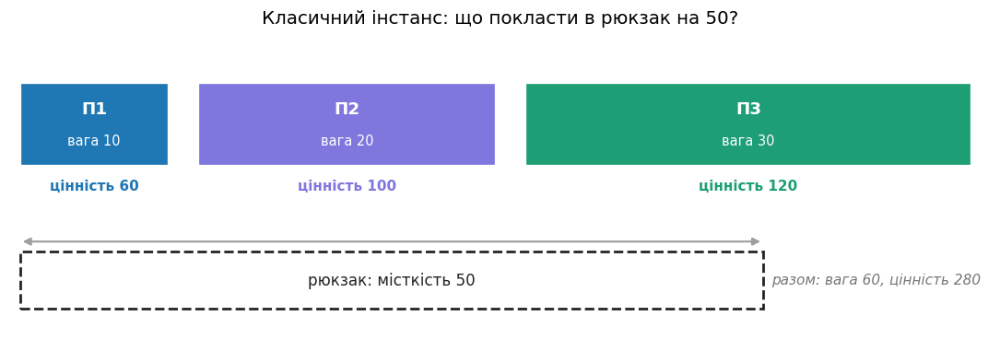

Далі в розборі працюватимуть **два інстанси** (обидва з конспекту):

- **класичний** (вище): `W = 50`, ваги `[10, 20, 30]`, цінності `[60, 100, 120]` — на ньому розберемо повний перебір і контрприклад для жадібного;
- **малий**: `W = 4`, ваги `[1, 2, 3]`, цінності `[6, 10, 12]` — його таблиця ДП має лише 4×5 клітинок, тож кожну видно на рисунку.

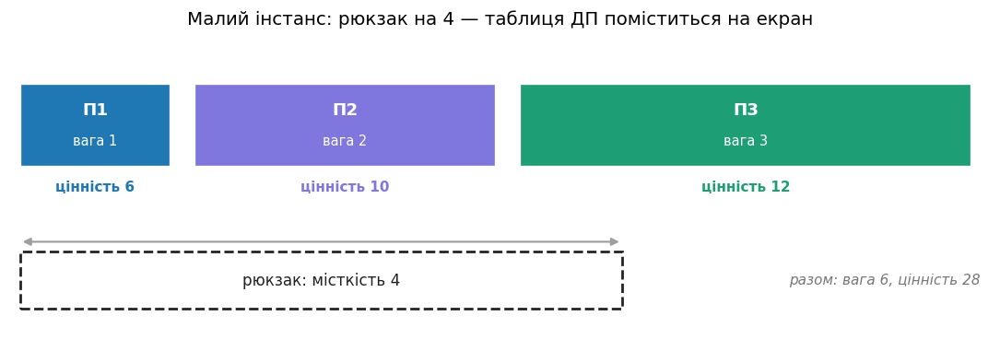

---

<a id="brute-idea"></a>

## Суть методу повного перебору (Brute-force)

Повний перебір — це найпростіша стратегія: ми **розглядаємо всі можливі варіанти** розв'язку, перевіряємо кожен на допустимість і обираємо найкращий.

Для рюкзака кожен предмет може бути або **взятий**, або **не взятий** — тобто 2 стани на предмет. Якщо предметів `n`, то всіх можливих комбінацій (підмножин):

$$2^n$$

Для нашої задачі: $2^3 = 8$ комбінацій. Алгоритм:

1. Згенерувати всі $2^n$ підмножин предметів.
2. Для кожної порахувати сумарну вагу та вартість.
3. Відкинути ті, де вага > місткості рюкзака.
4. Серед допустимих обрати ту, де вартість найбільша.

<a id="brute-subsets"></a>

## Усі комбінації для нашої задачі

| Комбінація       | Вага | Вартість | Влазить? |
|------------------|------|----------|----------|
| { }              | 0    | 0        | ✅       |
| { П1 }           | 10   | 60       | ✅       |
| { П2 }           | 20   | 100      | ✅       |
| { П3 }           | 30   | 120      | ✅       |
| { П1, П2 }       | 30   | 160      | ✅       |
| { П1, П3 }       | 40   | 180      | ✅       |
| **{ П2, П3 }**   | **50** | **220**| ✅ **← максимум** |
| { П1, П2, П3 }   | 60   | 280      | ❌ (60 > 50) |

**Відповідь:** беремо предмети **П2 і П3** → вага 50, вартість **220**.

Та сама таблиця, але рисунком — смуга кожної підмножини показує її вагу на тлі місткості (пунктир), праворуч вердикт ([`examples/01_brute_force.py`](examples/01_brute_force.py)):

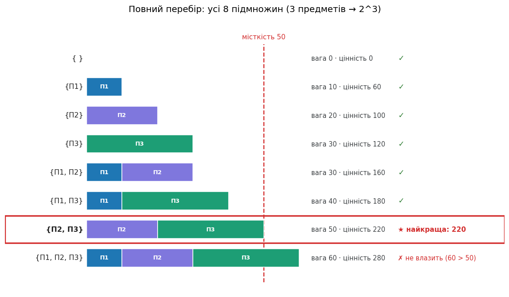

▶️ Перебір у русі — підмножини з'являються одна за одною, поточний лідер обведений рамкою:

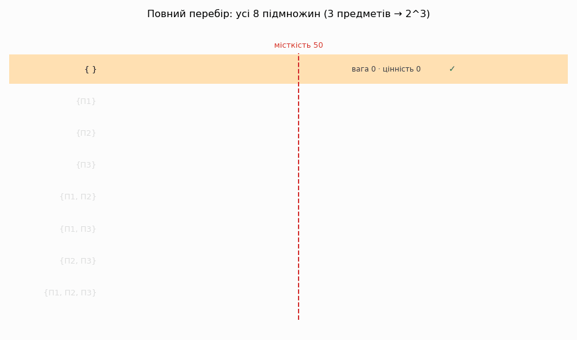

🎬 *MP4-версія:* [`subsets_classic.mp4`](docs/images/subsets_classic.mp4)

А ось вивід перебору в консолі — `★` позначає підмножини, які на момент перегляду ставали новим лідером (порядок: спершу менші, тож лідер змінюється часто; фінальний — `{П2, П3}`):

```text
підмножина       вага   вартість  підсумок
----------------------------------------------------------
{ }                 0          0  влазить
{П1}               10         60  влазить — нова найкраща ★
{П2}               20        100  влазить — нова найкраща ★
{П3}               30        120  влазить — нова найкраща ★
{П1, П2}           30        160  влазить — нова найкраща ★
{П1, П3}           40        180  влазить — нова найкраща ★
{П2, П3}           50        220  влазить — нова найкраща ★
{П1, П2, П3}       60        280  не влазить (60 > 50)
```

<a id="brute-code"></a>

## Базова реалізація — рекурсія «взяти / не брати»

Ось код із конспекту — його ми й розбираємо рядок за рядком (повна версія з документацією — [`knapsack_recursive`](knapsack/core.py)):

```python
# Функція для обчислення максимальної вартості
def knapSack(W, wt, val, n):
    # Базовий випадок
    if n == 0 or W == 0:
        return 0

    # Якщо вага n-го предмета більше, ніж місткість рюкзака, то цей предмет не можна включити у рюкзак
    if wt[n - 1] > W:
        return knapSack(W, wt, val, n - 1)

    # повертаємо максимум із двох випадків:
    # (1) n-ий предмет включено
    # (2) не включено
    else:
        return max(
            val[n - 1] + knapSack(W - wt[n - 1], wt, val, n - 1),
            knapSack(W, wt, val, n - 1),
        )

# ваги та вартість предметів
value = [60, 100, 120]
weight = [10, 20, 30]
# місткість рюкзака
capacity = 50
# кількість предметів
n = len(value)
# викликаємо функцію
print(knapSack(capacity, weight, value, n))  # 220
```

### Пояснення коду (рядок за рядком)

**`def knapSack(W, wt, val, n):`**
Функція приймає:
- `W` — поточну вільну місткість,
- `wt` — список ваг,
- `val` — список вартостей,
- `n` — скільки предметів ще розглядаємо.

**`if n == 0 or W == 0: return 0`**
Базовий (зупиняючий) випадок рекурсії. Якщо предметів не залишилось (`n == 0`) або місткість вичерпана (`W == 0`), додати більше нічого — повертаємо вартість 0.

**`if wt[n - 1] > W:`**
Дивимось на поточний предмет (його індекс `n - 1`, бо нумерація з 0). Якщо його вага більша за вільну місткість — взяти його **неможливо**. Тому просто переходимо до решти предметів: `knapSack(W, wt, val, n - 1)`.

**`else:` → `max(...)`** — найважливіша гілка, розбираємо окремо.

<a id="brute-branch"></a>

## Гілка `else:` → `max(...)` — детально

Сюди код потрапляє тоді, коли предмет **вміщається** у рюкзак (`wt[n - 1] <= W`). У задачі 0/1 з кожним предметом можна зробити лише **дві речі**: взяти його повністю або не брати зовсім. Тому ми чесно рахуємо **обидва** сценарії й залишаємо той, що дає більшу вартість, — за це й відповідає `max(...)`.

**Варіант 1 — взяти предмет:** `val[n - 1] + knapSack(W - wt[n - 1], wt, val, n - 1)`
- `val[n - 1]` — одразу «зараховуємо» вартість цього предмета.
- `W - wt[n - 1]` — місткість **зменшується** на вагу предмета (місце вже зайняте).
- `n - 1` — переходимо до решти предметів.

**Варіант 2 — не брати предмет:** `knapSack(W, wt, val, n - 1)`
- вартість предмета **не додаємо** (0);
- `W` — місткість лишається **без змін** (місце вільне);
- `n - 1` — так само переходимо до решти предметів.

Що змінюється у двох варіантах:

| Дія            | Накопичена вартість | Місткість `W`     | Предмети `n` |
|----------------|---------------------|-------------------|--------------|
| Взяти предмет  | `+ val[n - 1]`      | `W - wt[n - 1]`   | `n → n - 1`  |
| Не брати       | `+ 0`               | `W` (без змін)    | `n → n - 1`  |

> **Чому `n - 1` в обох випадках?** Рішення щодо `n`-го предмета вже **прийняте** (взяли або ні), і ми до нього більше не повертаємось. В обох гілках лишається та сама менша підзадача — «найкраще для перших `n - 1` предметів». Відрізняються гілки лише **місткістю** та **вже накопиченою вартістю**. Саме це розгалуження «взяти / не брати» на кожному предметі й породжує всі $2^n$ комбінацій.

**Конкретний приклад.** Виклик `knapSack(W=50, n=3)`, поточний предмет — **П3** (вага 30, вартість 120):

- **Взяти П3:** `120 + knapSack(20, ..., 2)` — забираємо 120, місткість падає до `50 − 30 = 20`, далі шукаємо найкраще для П1–П2 при місткості 20. Результат: `120 + 100 = 220`.
- **Не брати П3:** `knapSack(50, ..., 2)` — нічого не додаємо, місткість лишається 50, шукаємо найкраще для П1–П2 при місткості 50. Результат: `160`.

`max(220, 160) = 220` → вигідніше **взяти П3** (у парі з П2).

<a id="brute-tree"></a>

## Дерево рекурсії

Те саме питання «взяти чи ні?» повторюється для предмета 2, потім для предмета 1 — гілки подвоюються, виходить дерево. Кожен **рівень** вирішує долю одного предмета: корінь — П3, нижче — П2, листки — підзадачі з одним П1:

```
knapSack(50, 3)
│
├─ взяти П3 (+120) ─→ knapSack(20, 2) = 100
│  ├─ взяти П2 (+100) ─→ knapSack(0, 1)  = 0     (база: W=0)
│  └─ не брати П2      ─→ knapSack(20, 1) = 60
│     max(100, 60) = 100;  «взяти П3»: 120 + 100 = 220   ★ оптимум
│
└─ не брати П3 ───→ knapSack(50, 2) = 160
   ├─ взяти П2 (+100) ─→ knapSack(30, 1) = 60
   └─ не брати П2      ─→ knapSack(50, 1) = 60
      max(160, 60) = 160

КОРІНЬ:  max(220, 160) = 220  →  беремо П3 і П2 (вага 50, вартість 220)
```

Як читати дерево:

- у кожному вузлі написано, скільки максимум вартості дає ця підзадача (`knapSack(50, 2) = 160` — «найкраще для предметів П1–П2 при місткості 50»);
- вартість набирається на гілках «взяти» (+120, +100), а не у вузлах-листках;
- тому оптимальний шлях ★: листок дає 0 → беремо П2 (+100) → 100 → беремо П3 (+120) → **220**.

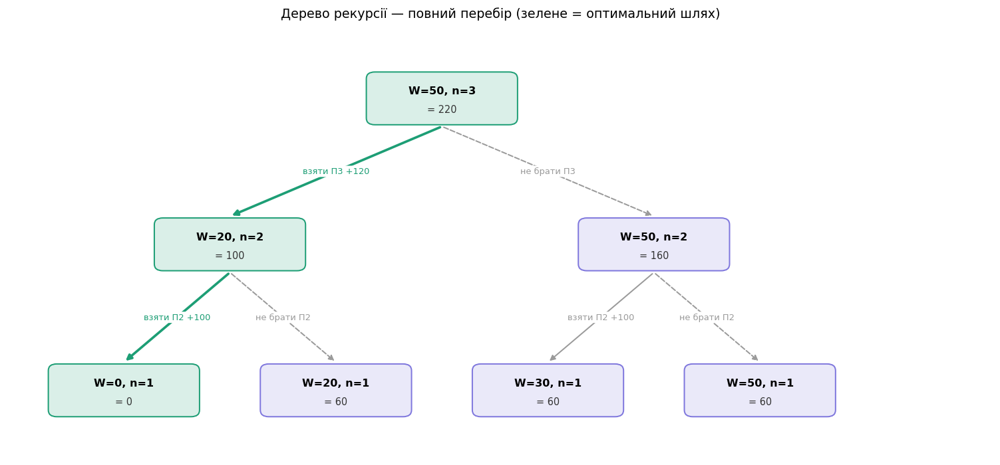

<a id="brute-trace"></a>

## Порядок виконання коду (трасування)

Python обчислює перший аргумент `max(...)` раніше за другий, тому функція завжди спершу пробує гілку «взяти», спускається вглиб до базового випадку, а потім рахує `max` на зворотному шляху:

1. `knapSack(50, 3)` — предмет П3 вміщається, тож рахуємо `max(взяти, не брати)`. Спершу — «взяти».
2. Взяли П3 (+120) → спускаємось у `knapSack(20, 2)`.
3. Предмет П2 вміщається. Спершу «взяти П2» (+100) → спускаємось у `knapSack(0, 1)`.
4. `knapSack(0, 1)`: місце скінчилось (`W = 0`) → базовий випадок → повертає **0**. Гілка «взяти П2» дала `100 + 0 = 100`.
5. Тепер «не брати П2» → `knapSack(20, 1)` повертає 60. Підсумок вузла: `max(100, 60) = 100`.
6. Повертаємось у корінь: гілка «взяти П3» = `120 + 100 = 220`.
7. Тепер «не брати П3» → `knapSack(50, 2) = 160` (права частина дерева).
8. Корінь: `max(220, 160) = 220` — відповідь. У рюкзаку опиняються П3 і П2.

<a id="brute-itertools"></a>

## Явний перебір підмножин (`itertools`)

Рекурсія перебирає комбінації неявно — через розгалуження викликів. Той самий перебір можна записати «в лоб»: згенерувати всі підмножини індексів і перевірити кожну. Бонус: ця версія повертає не лише вартість, а й **сам набір**. Код із конспекту (повна версія — [`knapsack_brute_force`](knapsack/core.py)):

```python
from itertools import combinations

def knapsack_brute_force(W, wt, val):
    n = len(val)
    best_value = 0
    best_combo = ()

    # перебираємо всі можливі підмножини предметів (2^n штук)
    for r in range(n + 1):
        for combo in combinations(range(n), r):
            total_weight = sum(wt[i] for i in combo)
            total_value = sum(val[i] for i in combo)
            # враховуємо лише ті, що влазять у рюкзак
            if total_weight <= W and total_value > best_value:
                best_value = total_value
                best_combo = combo

    return best_value, best_combo
```

Обидві версії дають ту саму відповідь ([`examples/01_brute_force.py`](examples/01_brute_force.py)):

```text
Рекурсивна версія (з конспекту): 220
Максимальна вартість: 220
Обрані предмети (індекси): (1, 2)
Тобто набір {П2, П3}: вага 50, цінність 220.
```

> Індекси `(1, 2)` — це позиції у списках `weight`/`value` (з нуля), тобто предмети **П2** і **П3**.

<a id="brute-explosion"></a>

## Чому це «вибухає»: ціна 2ⁿ

Жодна гілка дерева не пропускається — функція перевіряє **геть усі** комбінації (тут 8). Через це метод і називають повним перебором. У цьому його сила (відповідь гарантовано точна) і його прокляття: кожен новий предмет **подвоює** кількість гілок.

```text
Зростання кількості підмножин 2^n:
  n =  3  →  2^3 = 8 підмножин
  n = 10  →  2^10 = 1 024 підмножин
  n = 20  →  2^20 = 1 048 576 підмножин
  n = 30  →  2^30 = 1 073 741 824 підмножин
  n = 40  →  2^40 = 1 099 511 627 776 підмножин
  n = 50  →  2^50 = 1 125 899 906 842 624 підмножин
```

На лог-шкалі експонента $2^n$ — пряма, що залишає поліном $n \cdot W$ далеко внизу. Права панель — конкретний інстанс на 20 предметів: понад **мільйон** підмножин проти **1 281** клітинки таблиці ДП:

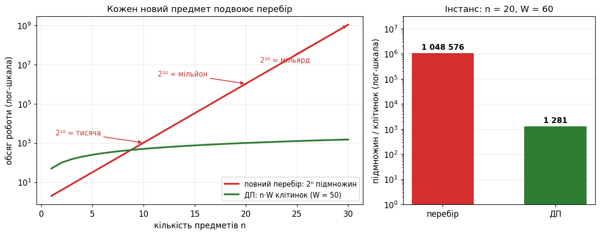

Скрипт [`examples/01_brute_force.py`](examples/01_brute_force.py) чесно проганяє обидва підходи на цьому інстансі (20 предметів, `W = 60`, числа зафіксовано в [`examples/_items.py`](examples/_items.py)):

```text
Повний перебір мусить оглянути 2^20 = 1 048 576 підмножин;
ДП заповнює таблицю (n+1)×(W+1) = 21×61 = 1 281 клітинок.
Однакова відповідь: перебір = 283, ДП = 283  →  збіг: True
```

На тестовій машині перебір цього інстансу займає **близько секунди**, а ДП — **частки мілісекунди** (різниця на 3–4 порядки); точний час залежить від машини, тож скрипт міряє і друкує його окремим рядком. На 30 предметах перебір зайняв би вже **тисячократно** довше — години; ДП лишилося б миттєвим.

### Переваги та недоліки повного перебору

**Переваги**
- **Простота.** Логіка очевидна, легко зрозуміти й реалізувати.
- **Гарантований результат.** Оскільки перевіряються абсолютно всі варіанти, відповідь завжди оптимальна (точна, а не наближена).
- **Універсальність.** Підходить майже для будь-якої задачі, де можна перелічити варіанти.

**Недоліки**
- **Експоненційна складність — $O(2^n)$.** Кількість комбінацій подвоюється з кожним новим предметом: 10 предметів → 1024 варіанти, 30 предметів → понад мільярд, 50 → астрономічне число.
- **Непридатний для великих вхідних даних.** Уже при кількох десятках предметів обчислення стають неможливими за розумний час.
- **Неефективність.** Багато варіантів перераховуються «з нуля», хоча є спільні підзадачі (саме це й виправляє динамічне програмування).

---

<a id="dp-idea"></a>

## Динамічне програмування: шпаргалка з підзадач

Динамічне програмування (ДП) — це спосіб розв'язати складну задачу, розбивши її на менші підзадачі, розв'язавши кожну **лише раз** і **зберігши** результати, щоб не рахувати їх повторно.

**Коли підходить:** задача має дві властивості —
- *оптимальна підструктура*: розв'язок великої задачі складається з розв'язків менших;
- *підзадачі повторюються*: одні й ті самі менші задачі трапляються багато разів.

Обидві властивості у рюкзака є. Погляньте ще раз на дерево рекурсії: різні гілки раз у раз приходять до **однакових** підзадач `knapSack(w, m)` — і наївна рекурсія чесно рахує їх щоразу заново. ДП натомість рахує кожну один раз.

Уявіть, що ви заповнюєте **шпаргалку** (таблицю), де кожна клітинка відповідає на одне маленьке питання:

> «Яку найбільшу вартість я зберу, якщо дозволено брати **тільки перші `i` предметів**, а рюкзак вміщає **`w` одиниць**?»

Це і є **`K[i][w]`**. Сенс — не розв'язувати велике питання одразу, а заповнювати шпаргалку від найлегших питань до найскладнішого:

1. **Найлегші випадки.** Якщо предметів нема (`i = 0`) або місця нема (`w = 0`) — відповідь завжди **0**. Це верхній рядок і лівий стовпець таблиці.
2. **Додаємо предмети по одному.** Для кожного нового предмета проходимо всі можливі розміри рюкзака і ставимо одне питання: **взяти цей предмет чи ні?**
   - **Не брати:** відповідь така сама, як без нього → дивимось у клітинку **прямо над** поточною.
   - **Взяти:** додаємо його вартість + найкраще, що влізе в **залишок місця**. А це вже записано в шпаргалці (рядок вище, стовпець «лівіше» рівно на вагу предмета).
   - Лишаємо **більше** з двох чисел.
3. Дійшли до останнього предмета й повної місткості → відповідь сидить у **правому нижньому куті** `K[n][W]`.

**У чому весь фокус:** повний перебір щоразу рахує ті самі під-питання заново (тому повільний). Динамічне програмування рахує кожне під-питання **лише раз**, записує відповідь у таблицю — і далі просто **підглядає**, а не рахує знову.

<a id="dp-formula"></a>

## Формула переходу

Для кожного предмета `i` та місткості `w`:

```
якщо wt[i-1] > w:   K[i][w] = K[i-1][w]
інакше:             K[i][w] = max( K[i-1][w] ,  val[i-1] + K[i-1][w - wt[i-1]] )
                                   └ не брати ┘   └────────── взяти ──────────┘
```

- Якщо предмет **не вміщається** (`wt[i-1] > w`) — переносимо значення зверху (єдиний можливий хід — не брати).
- Інакше беремо краще з двох: **не брати** (значення зверху) проти **взяти** (вартість предмета + найкраще рішення для залишку місткості з попередніх предметів).

Зверніть увагу: це **та сама** пара варіантів «взяти / не брати», що й у рекурсії повного перебору. Різниця лише в тому, що відповіді на підзадачі тепер не обчислюються заново, а **читаються з рядка вище**.

<a id="dp-code"></a>

## Базова реалізація — таблиця `K[i][w]`

Код із конспекту (повна версія з документацією — [`knapsack_dp`](knapsack/core.py)):

```python
def knapSack(W, wt, val, n):
    # створюємо таблицю K для зберігання оптимальних значень підзадач
    K = [[0 for w in range(W + 1)] for i in range(n + 1)]

    # будуємо таблицю K знизу вгору
    for i in range(n + 1):
        for w in range(W + 1):
            if i == 0 or w == 0:
                K[i][w] = 0
            elif wt[i - 1] <= w:
                K[i][w] = max(val[i - 1] + K[i - 1][w - wt[i - 1]], K[i - 1][w])
            else:
                K[i][w] = K[i - 1][w]

    return K[n][W]
```

### Пояснення коду (рядок за рядком)

- `K = [[0 ...] for i in range(n + 1)]` — таблиця з `n + 1` рядків (0…n предметів) і `W + 1` стовпців (місткість 0…W), заповнена нулями.
- Два цикли `for i ... for w ...` проходять усі підзадачі (кожен предмет × кожну місткість).
- `if i == 0 or w == 0:` → `K[i][w] = 0` — без предметів або без місця вартість нульова (базові випадки: верхній рядок і лівий стовпець).
- `elif wt[i - 1] <= w:` — поточний предмет вміщається, тож беремо кращий із двох варіантів:
  - `val[i - 1] + K[i - 1][w - wt[i - 1]]` — **взяти**: його вартість + найкраще рішення для залишку місткості з попередніх предметів;
  - `K[i - 1][w]` — **не брати**: переносимо значення з рядка вище.
- `else:` → `K[i][w] = K[i - 1][w]` — предмет не вміщається, переносимо значення зверху.
- `return K[n][W]` — у правому нижньому куті лежить відповідь.

> **Чому `i - 1` як індекс:** `i` — це *кількість* предметів у розгляді, а списки `wt`/`val` індексуються з 0, тож `i`-й предмет має індекс `i - 1`.

<a id="dp-nofit"></a>

## Чому при «не вміщується» беремо значення зверху

**Суть:** якщо предмет не влазить, єдиний можливий хід — не брати його, а це те саме, що готова відповідь для набору на один предмет менший.

Згадаймо, що означає сама клітинка: **`K[i][w]`** — найкраща вартість, яку можна зібрати, маючи дозвіл користуватися **лише першими `i` предметами** і місткість `w`. Коли ми доходимо до предмета `i`, у нас завжди є **рівно два варіанти**: взяти його або не брати. Саме з них `max(...)` обирає кращий.

Але якщо `wt[i-1] > w` (предмет важчий за вільне місце), варіант **«взяти» стає неможливим** — предмет фізично не влізе. Залишається єдиний варіант: **«не брати»**.

А що означає «не брати предмет `i`»? Що набір, з якого ми реально вибираємо, звужується до **перших `i − 1` предметів**, а місткість лишається тією самою `w` (ми ж нічого не поклали). І найкраща відповідь для цієї ситуації вже порахована — це **`K[i−1][w]`**. Рядок `i − 1` — «на один предмет менше», той самий стовпець `w` — «та сама місткість»: клітинка `K[i−1][w]` стоїть **точно над** `K[i][w]`. Тому «не брати предмет, що не влазить» = «скопіювати готову відповідь із клітинки згори».

**Це не втрата, а «нічого не змінилось».** Додавання до набору ще одного предмета, яким ми все одно не можемо скористатися, не здатне ні покращити, ні погіршити результат. Тому оптимум лишається таким самим, як на попередньому рядку.

**Це окремий випадок загальної формули.** «Перенесення зверху» — не окреме правило, а спрощення `max`:

```
K[i][w] = max( K[i-1][w] ,  val + K[i-1][w - wt] )
               ▲                     ▲
            не брати              взяти   ← відпадає, бо предмет не влазить
```

Коли «взяти» неможливо, у `max` лишається тільки перший доданок → `K[i][w] = K[i-1][w]`.

**Приклад із таблиці нижче.** `K[2][1]`: предмет П2 важить 2, а місткість лише 1. Оскільки 2 > 1, П2 не влазить. Тоді «найкраще з {П1, П2} при місткості 1» = «найкраще з {П1} при місткості 1» = **6**. Саме це значення стоїть згори, у `K[1][1]`. Новий предмет не вліз — відповідь не змінилась.

<a id="dp-walkthrough"></a>

## Покрокове заповнення таблиці (малий інстанс)

Щоб кожна клітинка вмістилася на екран, переходимо на **малий інстанс**: рюкзак на **4** одиниці, предмети П1 (вага 1, варт. 6), П2 (вага 2, варт. 10), П3 (вага 3, варт. 12). Таблиця — лише 4×5. Усі рисунки й виводи цього розділу генерує [`examples/02_dp_small.py`](examples/02_dp_small.py).

Як читати візуалізацію:

- 🟧 **помаранчева рамка** — клітинка, що заповнюється зараз;
- 🟦 **синя клітинка** — джерело «не брати» (прямо над поточною);
- 🟩 **зелена клітинка** — джерело «взяти» (рядок вище, лівіше рівно на вагу предмета);
- 🟨 **жовті клітинки** — шлях зворотного проходу (з'являться у відновленні);
- 🔴 **червона рамка** — клітинка-відповідь `K[n][W]`.

### Старт: базовий рядок

Створюємо таблицю нулів. Рядок `i = 0` («жодного предмета») — одразу готовий базовий випадок; стовпець `w = 0` теж завжди 0:

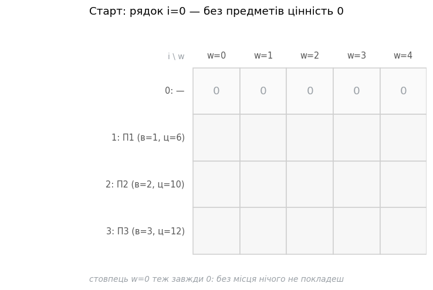

### Рядок i=1 — дозволено лише П1 (вага 1, варт. 6)

П1 (вага 1) влазить у будь-яку місткість від 1, тож скрізь «взяти» (6) перемагає «не брати» (0):

```text
=== Рядок i=1  (П1: вага=1, вартість=6) ===
K[1][0]: базовий випадок (w=0)  =>  0
K[1][1]: вага 1 <= 1 -> вміщується -> max(не брати=0, взяти 6+K[0][0]=6)  =>  6
K[1][2]: вага 1 <= 2 -> вміщується -> max(не брати=0, взяти 6+K[0][1]=6)  =>  6
K[1][3]: вага 1 <= 3 -> вміщується -> max(не брати=0, взяти 6+K[0][2]=6)  =>  6
K[1][4]: вага 1 <= 4 -> вміщується -> max(не брати=0, взяти 6+K[0][3]=6)  =>  6
```

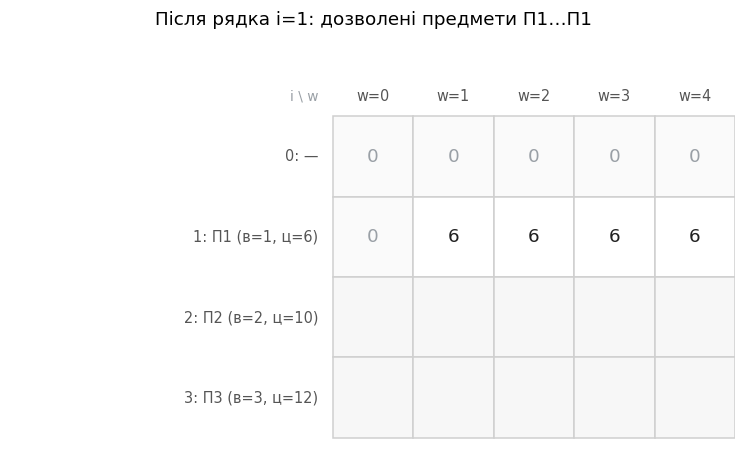

### Рядок i=2 — дозволено П1 і П2 (П2: вага 2, варт. 10)

Тут уже видно всі сценарії: у `w = 1` П2 **не влазить** (беремо зверху 6), у `w = 2` вигідніше **замінити** П1 на П2 (10 > 6), а від `w = 3` влазять **обидва** (10 + 6 = 16):

```text
=== Рядок i=2  (П2: вага=2, вартість=10) ===
K[2][0]: базовий випадок (w=0)  =>  0
K[2][1]: вага 2 > 1 -> не вміщується -> беремо згори K[1][1]=6  =>  6
K[2][2]: вага 2 <= 2 -> вміщується -> max(не брати=6, взяти 10+K[1][0]=10)  =>  10
K[2][3]: вага 2 <= 3 -> вміщується -> max(не брати=6, взяти 10+K[1][1]=16)  =>  16
K[2][4]: вага 2 <= 4 -> вміщується -> max(не брати=6, взяти 10+K[1][2]=16)  =>  16
```

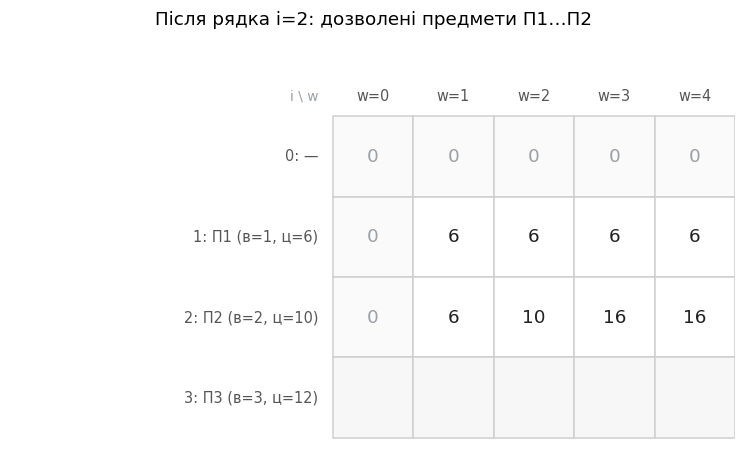

### Рядок i=3 — дозволені всі (П3: вага 3, варт. 12)

Найцікавіший рядок. У `w = 3` П3 **влазить, але брати його невигідно** (12 < 16) — `max` лишає «не брати». І лише в `w = 4` зʼявляється справжня відповідь: `12 + K[2][1] = 12 + 6 = 18`:

```text
=== Рядок i=3  (П3: вага=3, вартість=12) ===
K[3][0]: базовий випадок (w=0)  =>  0
K[3][1]: вага 3 > 1 -> не вміщується -> беремо згори K[2][1]=6  =>  6
K[3][2]: вага 3 > 2 -> не вміщується -> беремо згори K[2][2]=10  =>  10
K[3][3]: вага 3 <= 3 -> вміщується -> max(не брати=16, взяти 12+K[2][0]=12)  =>  16
K[3][4]: вага 3 <= 4 -> вміщується -> max(не брати=16, взяти 12+K[2][1]=18)  =>  18
```

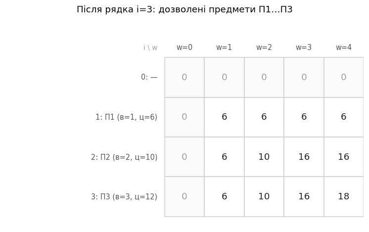

<a id="dp-cells"></a>

## Найцікавіші клітинки — формула в кадрі

Чотири «знакові» клітинки крупним планом: таблиця заповнена рівно до поточної клітинки, стрілки ведуть від джерел, унизу — формула переходу з числами.

**`K[1][1]` — перше «взяти».** П1 влазить ушир в одиницю місткості; `max(0, 6) = 6`:

![Клітинка K[1][1]: перше «взяти»](docs/images/dp_cell_small_i1_w1.png)

**`K[2][3]` — «взяти» з ненульовим залишком.** Поклали П2 (вага 2), лишилась 1 одиниця — а найкраще для неї вже пораховано в рядку вище: `K[1][1] = 6`. Разом `10 + 6 = 16`:

![Клітинка K[2][3]: взяти + залишок](docs/images/dp_cell_small_i2_w3.png)

**`K[3][3]` — влазить, але НЕ беремо.** Найповчальніший випадок: П3 фізично вміщається, проте `взяти = 12 + K[2][0] = 12` програє `не брати = 16` (пара П1+П2 цінніша за самотній П3):

![Клітинка K[3][3]: влазить, але не беремо](docs/images/dp_cell_small_i3_w3.png)

**`K[3][4]` — клітинка-відповідь.** `взяти = 12 + K[2][1] = 18` перемагає `не брати = 16`:

![Клітинка K[3][4]: відповідь 18](docs/images/dp_cell_small_i3_w4.png)

▶️ Усі 15 клітинок поспіль — повна анімація заповнення з формулою в кожному кадрі:

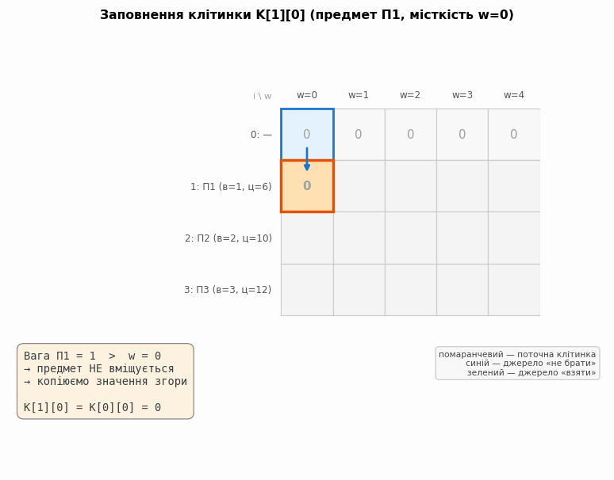

🎬 *MP4-версія:* [`dp_fill_small.mp4`](docs/images/dp_fill_small.mp4)

<a id="dp-evolution"></a>

## Зведена картина: еволюція таблиці

Усі стани поряд: видно, як кожен рядок «успадковує» попередній і подекуди покращує його. Цифри в рядку ростуть зліва направо (більше місця — не гірше), а в стовпці згори вниз (більше предметів — не гірше):

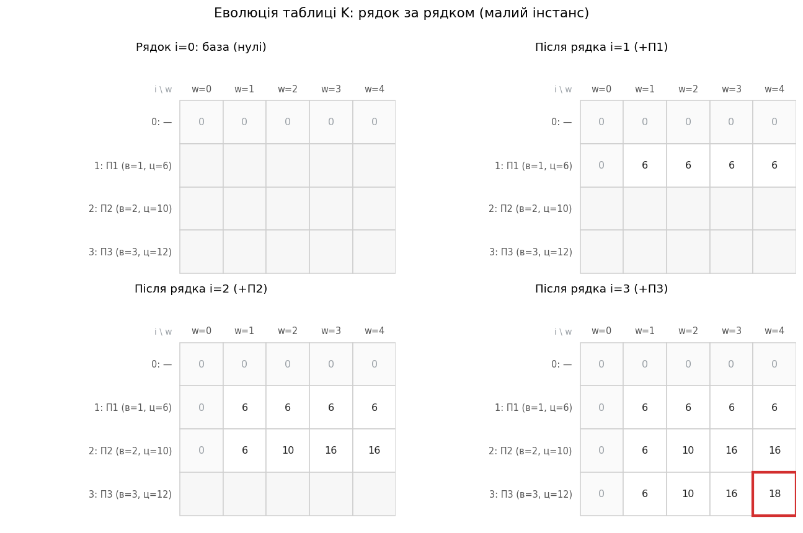

▶️ Те саме в русі:

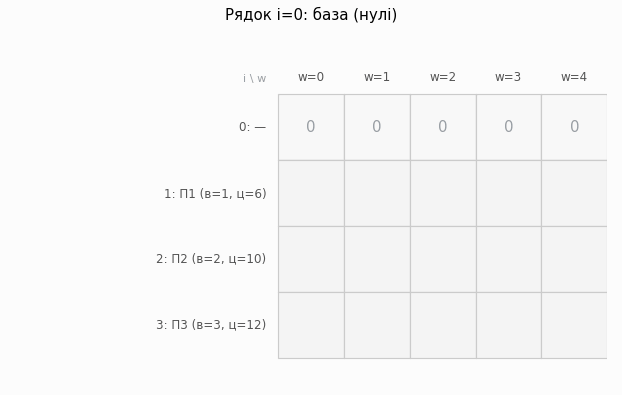

🎬 *MP4-версія:* [`dp_evolution_small.mp4`](docs/images/dp_evolution_small.mp4)

Підсумкова таблиця й відповідь у текстовому вигляді:

```text
 i \ w |   0   1   2   3   4
-------+--------------------
 0 (—) |   0   0   0   0   0
 1 +П1 |   0   6   6   6   6
 2 +П2 |   0   6  10  16  16
 3 +П3 |   0   6  10  16  18

ВІДПОВІДЬ = K[3][4] = 18
```

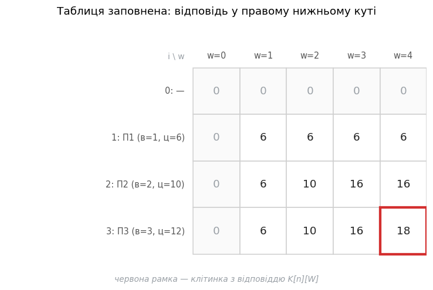

<a id="dp-backtrack"></a>

## Відповідь і відновлення набору зворотним проходом

Таблиця каже лише, **скільки** коштує оптимум (`K[3][4] = 18`), а не **з чого** він складається. Щоб дістати сам набір, пройдемося по таблиці **знизу вгору** — це аналог відновлення шляху в алгоритмах на графах, тільки замість матриці попередників у нас сама таблиця `K`.

Ключове спостереження: значення `K[i][w]` могло взятися **лише з двох місць** — або це `K[i-1][w]` (предмет `i` не брали), або це `val[i-1] + K[i-1][w - wt[i-1]]` (брали). Тож достатньо порівняти клітинку зі значенням **прямо над нею**:

- `K[i][w] == K[i-1][w]` → предмет `i` **не брали**; піднімаємось рядком вище з тим самим `w`;
- `K[i][w] != K[i-1][w]` → таке значення могло з'явитися лише з гілки «взяти» → предмет `i` **у наборі**; піднімаємось рядком вище і **звільняємо його вагу**: `w -= wt[i-1]`.

Код із конспекту (повна версія — [`reconstruct_items`](knapsack/core.py)):

```python
# Зворотний хід: відновлюємо набір предметів
w = W
chosen = []
for i in range(n, 0, -1):
    if dp[i][w] != dp[i - 1][w]:      # значення змінилось -> предмет i був узятий
        chosen.append(names[i - 1])
        w -= weights[i - 1]           # звільняємо вагу, яку зайняв предмет
chosen.reverse()
```

> У конспекті таблиця в цьому фрагменті називається `dp` — це та сама `K` (обидві назви трапляються в літературі). І ще одна відмінність: конспектний фрагмент складає список **імен** (`names[i - 1]`), а пакетна [`reconstruct_items`](knapsack/core.py) повертає **0-базові індекси** обраних предметів — імена до них додають уже приклади.

Хід на малому інстансі — три порівняння, три рішення:

```text
i=3, w=4: K[3][4]=18 ≠ K[2][4]=16 → П3 УЗЯТО, w ← 1
i=2, w=1: K[2][1]=6 = K[1][1]=6 → П2 не брали
i=1, w=1: K[1][1]=6 ≠ K[0][1]=0 → П1 УЗЯТО, w ← 0

Обрані предмети: ['П1', 'П3']
Сумарна вага:    4
Сумарна вартість: 18
```

На рисунку шлях підсвічено жовтим: зелена стрілка = «предмет узято» (стрибок ліворуч-угору на його вагу), сіра пунктирна = «не брали» (рух прямо вгору):

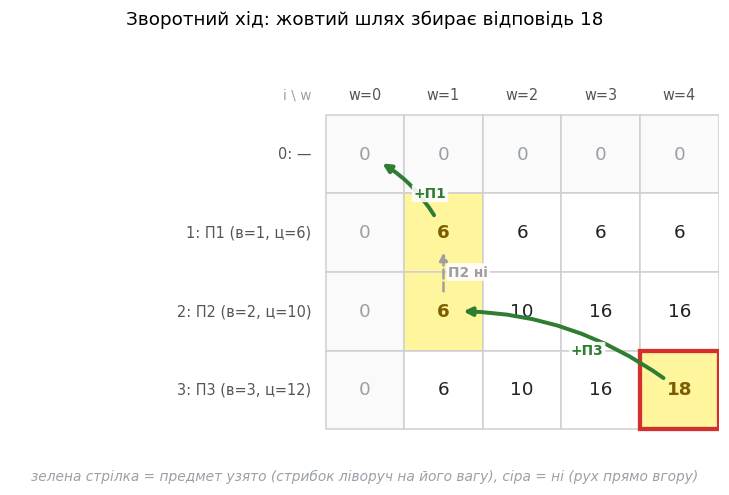

▶️ Покроково — кожен кадр показує одне порівняння «клітинка проти клітинки зверху»:

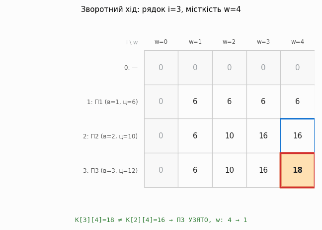

🎬 *MP4-версія:* [`backtrack_small.mp4`](docs/images/backtrack_small.mp4)

<a id="dp-classic"></a>

## Класичний інстанс: таблиця для W = 50

Повернімося до початкової задачі (`W = 50`, ваги `[10, 20, 30]`). Таблиця тут — 4 рядки × **51 стовпець**, але оскільки всі ваги кратні 10, значення змінюються лише на кратних 10 місткостях. Тому показуємо зведену версію ([`examples/03_dp_classic.py`](examples/03_dp_classic.py)):

```text
 i \ w |   0  10  20  30  40  50
-------+------------------------
 0 (—) |   0   0   0   0   0   0
 1 +П1 |   0  60  60  60  60  60
 2 +П2 |   0  60 100 160 160 160
 3 +П3 |   0  60 100 160 180 220

ВІДПОВІДЬ = K[3][50] = 220
```

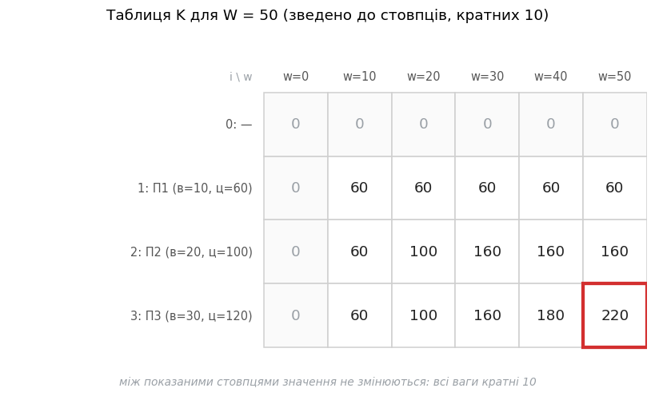

Як «дозрівав» нижній рядок (дозволені всі три предмети):

- `w = 0…9` → 0 (нічого не влазить);
- `w = 10…19` → 60 (влазить лише П1);
- `w = 20…29` → 100 (П2 сам вигідніший за П1);
- `w = 30…39` → 160 (П1 + П2);
- `w = 40…49` → 180 (П1 + П3 обганяє П1 + П2);
- рівно `w = 50` → **220** (П2 + П3 — цій парі потрібно саме 50 одиниць).

**Як вийшла відповідь 220.** Дивимось на праву нижню клітинку `K[3][50]`. Предмет П3 має вагу 30 ≤ 50, тож рахуємо максимум із двох варіантів:

- **не брати П3:** значення зверху → `K[2][50] = 160`;
- **взяти П3:** його вартість + рішення для залишку місткості (`50 − 30 = 20`) з двох попередніх предметів → `120 + K[2][20] = 120 + 100 = 220`.

`max(160, 220) = 220`. Перемагає «взяти П3», і фінальна відповідь зібрана з клітинок `K[2][50]` та `K[2][20]` — у рюкзаку опиняються П3 і П2.

Зворотний прохід підтверджує (усі його зупинки — `w = 50 → 20 → 0` — кратні 10, тож потрапляють у зведені стовпці):

```text
Обрані предмети: ['П2', 'П3']
Сумарна вага:    50
Сумарна вартість: 220
```

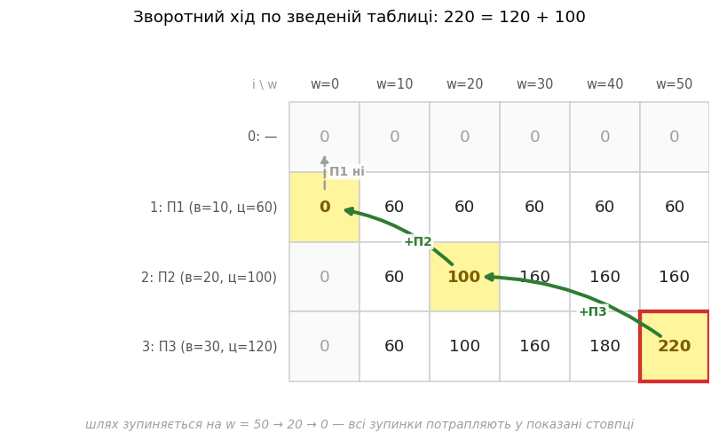

Той самий **220**, що його дав повний перебір, — лише за 204 операції з клітинками замість перегляду всіх підмножин (для 3 предметів різниця мізерна, але вона експоненційно росте з `n`).

---

<a id="code-walkthrough"></a>

## Покрокове виконання коду: панелі «код ↔ таблиця»

Розділи вище показували *результат* кожного кроку — як «дозріває» таблиця. Тут — **сам код у дії**: ліворуч фрагмент алгоритму з **підсвіченими активними рядками**, праворуч — стан таблиці `K` саме на цьому кроці. **Колір рядка коду кодує, яка гілка спрацювала:** 🟨 рядок виконується зараз, 🟩 гілка «взяти» перемогла, 🟥 значення просто перенесено зверху («не брати» виграло або предмет не влазить).

> У кодовій панелі `max(take, skip)` розгорнуто в три рядки (`take = …`, `skip = …`, `max(…)`) — так, як у журнальній версії конспекту: щоб гілки «взяти» і «не брати» підсвічувались окремо.

Обидва рівні деталізації будуються з одного журналу кроків ([`knapsack/walkthrough.py`](knapsack/walkthrough.py), права панель — повторно `draw_dp_table`); генерує їх приклад [`examples/06_code_walkthrough.py`](examples/06_code_walkthrough.py).

### Огляд: один крок на рядок таблиці

Зовнішній цикл `for i` додає предмети по одному; права панель — таблиця після кожного рядка:

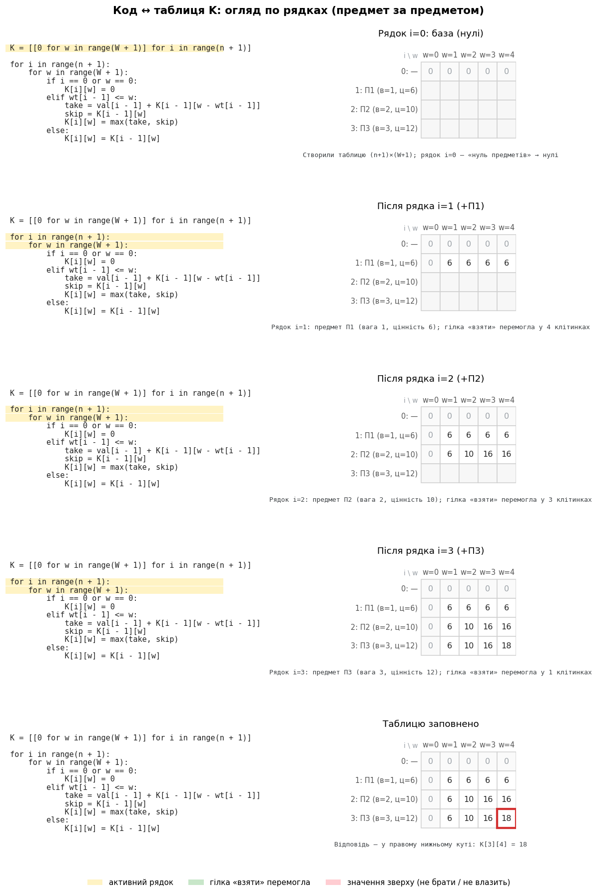

### Детально: крок = одна клітинка

Для найпоказовішого рядка (`i = 3` — у ньому трапляються **всі** гілки переходу: база, «не влазить», «не брати» і «взяти») розгортаємо внутрішній цикл по клітинках:

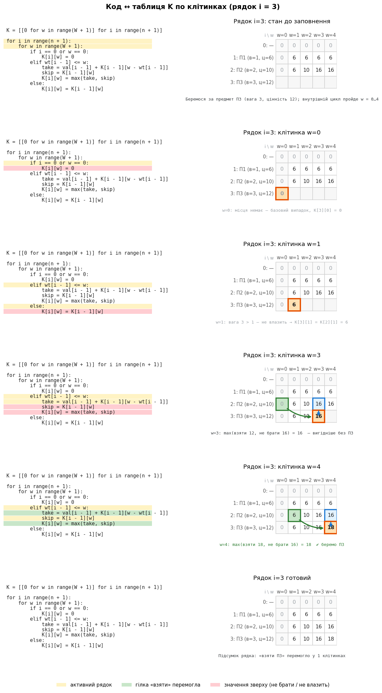

▶️ Те саме в русі — повний скан рядка `w = 0…4`:

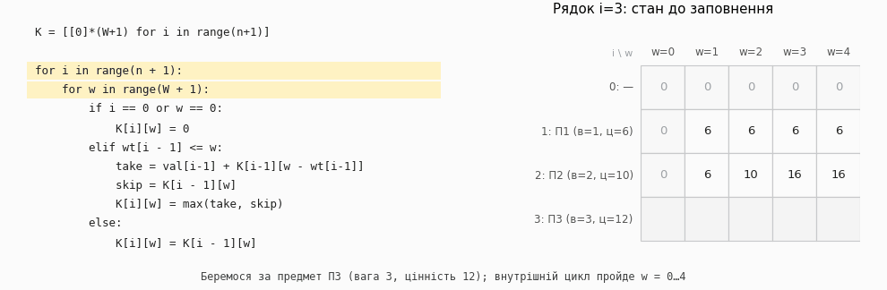

🎬 *MP4-версія:* [`code_walk_small_i3.mp4`](docs/images/code_walk_small_i3.mp4)

### Той самий код на класичному інстансі

Код не змінився ні на символ — змінилися лише дані (`W = 50`, стовпці зведено до кратних 10):

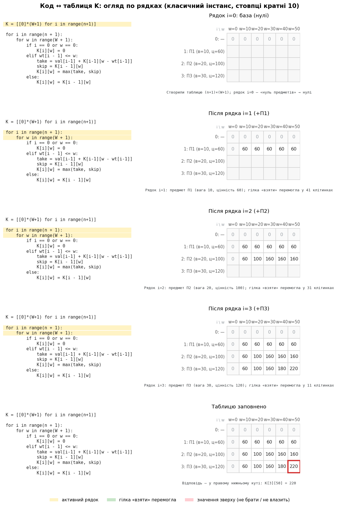

---

<a id="comparison"></a>

## Порівняння трьох підходів

Усі три методи на **одному** класичному інстансі ([`examples/03_dp_classic.py`](examples/03_dp_classic.py)):

```text
Повний перебір (рекурсія):   220
Повний перебір (itertools):  220, набір {П2, П3}
Динамічне програмування:     220, набір {П2, П3}
Жадібний метод:              160  ← НЕ оптимум (втрачає 60)
```

| Метод            | Відповідь | Складність | Пам'ять | Оптимум? |
|------------------|-----------|------------|---------|----------|
| Повний перебір   | 220       | $O(2^n)$   | $O(n)$  | ✅ так   |
| Жадібний         | 160       | $O(n \log n)$ | $O(1)$ | ❌ ні (для 0/1) |
| Динамічне прогр. | 220       | $O(n \cdot W)$ | $O(n \cdot W)$ | ✅ так   |

**Висновок:** брутфорс і ДП дають правильні 220, але ДП робить це набагато ефективніше. Жадібний метод найшвидший, проте для задачі 0/1 може помилятися.

> **Про нічиї.** Якщо оптимальних наборів кілька (різні набори тієї самої максимальної вартості), точні методи можуть назвати різні з них: перебір повертає перший знайдений у порядку перегляду (менші підмножини — раніше), а зворотний прохід ДП збирає набір за правилом «нічия → не брати». **Вартість збігається завжди** — саме її й звіряють тести. На класичному інстансі оптимальний набір єдиний, тож розбіжності тут немає.

### Пояснення складності словами

**Повний перебір — $O(2^n)$ — експоненційна складність.**
Метод перевіряє всі можливі комбінації предметів: брати предмет або не брати. Тому з кожним новим предметом кількість варіантів подвоюється. Якщо предметів мало, метод працює нормально, але при великій кількості стає непридатно повільним.

**Жадібний метод — $O(n \log n)$ — лінійно-логарифмічна складність.**
Спочатку предмети сортуються за співвідношенням цінності до ваги — саме сортування і займає найбільше часу. Після цього алгоритм один раз швидко проходить по списку. Тому жадібний метод дуже швидкий, але для задачі 0/1 не завжди знаходить найкращий результат.

**Динамічне програмування — $O(n \cdot W)$ — псевдополіноміальна складність.**
Метод заповнює таблицю рішень для кожного предмета × кожної місткості: `n` — кількість предметів, `W` — місткість рюкзака. ДП працює значно швидше за повний перебір і гарантує оптимальну відповідь, але потребує $O(n \cdot W)$ пам'яті на таблицю (можна оптимізувати до $O(W)$, тримаючи один рядок, — щоправда, тоді втрачається просте відновлення набору зворотним проходом).

**Коли який підхід доречний:**

- **повний перебір** — коли предметів зовсім мало (до ~20) або потрібен незаперечний еталон для перевірки інших методів (саме так він використовується у [тестах](tests/test_core.py) цього репозиторію);
- **ДП** — коли `n · W` помірне (тисячі–мільйони клітинок): це і точність, і швидкість;
- **жадібний** — лише як швидка евристика «хоч щось», або для *дробової* задачі, де він справді оптимальний.

---

<a id="greedy"></a>

## Обмеження 1: жадібний метод не розв'язує задачу 0/1

Перша думка в багатьох: «бери найвигідніші за грам предмети, поки влазять». Це **жадібна стратегія**:

1. Для кожного предмета порахувати «питому цінність» = **вартість / вага**.
2. Відсортувати предмети за цим співвідношенням від більшого до меншого.
3. Йти по списку й брати предмет, якщо він ще вміщається у рюкзак.

> ⚠️ **Важливо.** Для задачі **0/1** (предмет беремо повністю або не беремо зовсім) жадібний метод **не гарантує оптимальний результат**. Він оптимальний лише для **дробової** задачі (коли предмет можна брати частинами).

Код із конспекту (повна версія — [`knapsack_greedy`](knapsack/core.py)):

```python
class Item:
    def __init__(self, weight, value):
        self.weight = weight
        self.value = value
        self.ratio = value / weight

def knapSack(items: list[Item], capacity: int) -> int:
    items.sort(key=lambda x: x.ratio, reverse=True)
    total_value = 0
    for item in items:
        if capacity >= item.weight:
            capacity -= item.weight
            total_value += item.value
    return total_value
```

### Пояснення коду

- `self.ratio = value / weight` — конструктор `Item` одразу рахує «питому цінність» (вартість на одиницю ваги); саме за нею жадібний обиратиме.
- `items.sort(key=lambda x: x.ratio, reverse=True)` — сортуємо від більшого до меншого: спочатку найвигідніші «за грам».
- `for item in items:` + `if capacity >= item.weight:` — проходимо у відсортованому порядку; якщо предмет ще вміщається — беремо: зменшуємо вільне місце, додаємо вартість.
- Якщо не вміщається — предмет просто пропускається (у задачі 0/1 частину взяти не можна) — і алгоритм **ніколи не передумує**.

### Хід на наших даних

```text
Питома цінність (вартість / вага):
  П1: 60 / 10 = 6.0
  П2: 100 / 20 = 5.0
  П3: 120 / 30 = 4.0
```

Порядок після сортування не змінюється: П1 (6.0) → П2 (5.0) → П3 (4.0). Далі ([`examples/04_greedy_limitation.py`](examples/04_greedy_limitation.py)):

```text
Хід жадібного (за спаданням ratio):
  П1 (вага 10): взято   → вільно 50 → 40, цінність 60
  П2 (вага 20): взято   → вільно 40 → 20, цінність 160
  П3 (вага 30): пропуск (треба 30 > вільно 20)

Результат жадібного методу: 160
Оптимум (ДП на тому самому інстансі): 220
Жадібний втратив 60: дешевий «вигідний за грам» П1 заблокував пару {П2, П3}.
```

### Чому жадібний програє

Жадібний спокусився на маленький П1 з найбільшим `ratio` — і через це не зміг узяти важкий П3. Порівняймо заповнення рюкзака:

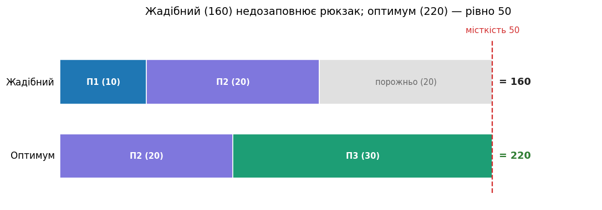

Жадібний дивиться лише на вигідність поточного предмета й не помічає, що відмова від П1 звільнила б місце під значно ціннішу пару {П2, П3}, яка заповнює рюкзак **рівно** (50 із 50). Він швидкий ($O(n \log n)$), але «локально найкращий» вибір не складається у глобально найкращий.

> **А чому ж у дробовій задачі жадібний оптимальний?** Там, коли черговий предмет не влазить цілком, можна взяти його **частину** і заповнити рюкзак до останнього грама найвигіднішою доступною «речовиною». Порожнього місця не лишається — і саме воно було єдиною причиною програшу в 0/1. У нашому прикладі дробовий жадібний взяв би П1, П2 і **дві третини П3** (`160 + 80 = 240` — більше за 220, бо це вже інша, легша задача).

### Переваги та недоліки жадібного методу

**Переваги**
- **Дуже швидкий.** Складність ≈ $O(n \log n)$ (основний час — це сортування).
- **Мало пам'яті.** Не потребує таблиць чи рекурсивного дерева.
- **Простий** в реалізації та розумінні.

**Недоліки**
- **Не гарантує оптимум для задачі 0/1** — може дати гіршу відповідь (як тут: 160 замість 220).
- **Залежить від «локального» вибору** і не вміє переглядати рішення назад.
- Оптимальний лише для **дробової** задачі про рюкзак.

<a id="pseudo"></a>

## Обмеження 2: дуже великий W (псевдополіноміальність)

$O(n \cdot W)$ виглядає як поліном — але це поліном від **числа** `W`, а не від **розміру входу**. Число `W` записується у вході лише $\log_2 W$ бітами, тож відносно довжини запису складність насправді експоненційна: $O(n \cdot 2^{\text{бітів у } W})$. Саме тому її називають **псевдополіноміальною**.

На практиці це означає: ДП чудове, поки `W` помірне, і безпорадне, коли `W` величезне.

- `n = 30, W = 1 000` → таблиця ~31 тис. клітинок — миттєво.
- `n = 30, W = 10 000 000` → ~310 **мільйонів** клітинок — уже й часу, і пам'яті боляче.
- `n = 30, W = 10¹⁵` (наприклад, ваги в міліграмах на тоннажному складі) → таблиця фізично не існує. А от $2^{30}$ ≈ мільярд гілок перебору — раптом уже **менше** за `n · W`: на таких даних чесний перебір (та його розумні варіанти типу meet-in-the-middle за $O(2^{n/2})$) обганяє ДП.
- дробові ваги (`2.37 кг`) у таблицю індексів узагалі не лягають без масштабування в цілі числа — а масштабування знову роздуває `W`.

Це не випадковий дефект реалізації: задача про рюкзак 0/1 — **NP-повна**, тож точного алгоритму, поліноміального від довжини входу, для неї не відомо. Усі точні методи десь платять експонентою — перебір по `n`, ДП по бітах `W`. Коли завеликі обидва виміри, лишаються наближені схеми (зокрема FPTAS — ДП за *цінностями* з контрольованою похибкою) або евристики на кшталт жадібного — уже без гарантії оптимуму.

> Підсумкове правило вибору: мале `n` → перебір; помірне `n · W` → ДП; і велике `n`, і велике `W` → точно й швидко не вийде, обирайте компроміс.

---

<a id="applications"></a>

## Де це застосовується

«Рюкзак» — це шаблон будь-якого вибору під обмеження ресурсу, тому та сама таблиця `K[i][w]` з'являється в зовсім різних предметних областях:

- **Бюджетування та інвестиційний портфель.** Проєкти з вартістю (вага) та очікуваним прибутком (цінність), фіксований бюджет — обрати підмножину проєктів із максимальним сумарним ефектом.
- **Завантаження транспорту.** Вантажі з вагою/об'ємом і фрахтовою вартістю, обмеження вантажопідйомності контейнера чи літака.
- **Розклад і ресурси.** Задачі з тривалістю (вага) і користю (цінність) при фіксованому фонді часу процесора, верстата або людини.
- **Розкрій і пакування.** Одновимірний розкрій матеріалу, нарізання заготовок: «місткість» — довжина прута, «предмети» — деталі.
- **Криптографія (історично).** Ранцеві криптосистеми (Меркла–Геллмана) будувалися на складності задачі про рюкзак; їх зламали — але сама задача лишилась класикою теорії складності.

Спільна риса: ресурс один і цілочисельний, предмети неподільні, і потрібен **точний** оптимум — саме профіль ДП по рюкзаку.

<a id="summary"></a>

## Підсумок

- Задача 0/1: кожен предмет **береться цілком або не береться** — звідси $2^n$ варіантів і непридатність жадібного.
- **Повний перебір** перевіряє всі підмножини: гарантовано точний, прозорий, але $O(2^n)$ — кожен предмет подвоює роботу (20 предметів — мільйон варіантів, 30 — мільярд).
- **ДП** відповідає на $((n+1) \times (W+1))$ маленьких питань «найкраще для перших `i` предметів і місткості `w`», кожне — один раз: $O(n \cdot W)$ часу й пам'яті, відповідь у `K[n][W]`.
- Формула переходу — той самий вибір «взяти / не брати»: `K[i][w] = max(K[i-1][w], val[i-1] + K[i-1][w - wt[i-1]])`; якщо предмет не влазить — просто значення зверху.
- **Набір предметів** відновлюється зворотним проходом: `K[i][w] != K[i-1][w]` ⇔ предмет `i` узято.
- На класичному інстансі перебір і ДП дають **однакові 220** (П2 + П3); жадібний — лише 160: «найвигідніший за грам» П1 блокує оптимальну пару.
- $O(n \cdot W)$ — **псевдополіноміальна** складність: для величезних чи дробових `W` таблиця непідйомна, і це не баг, а наслідок NP-повноти задачі.

---

<a id="license"></a>

## Ліцензія

[MIT](LICENSE) © 2026 Maryna Shavlak
